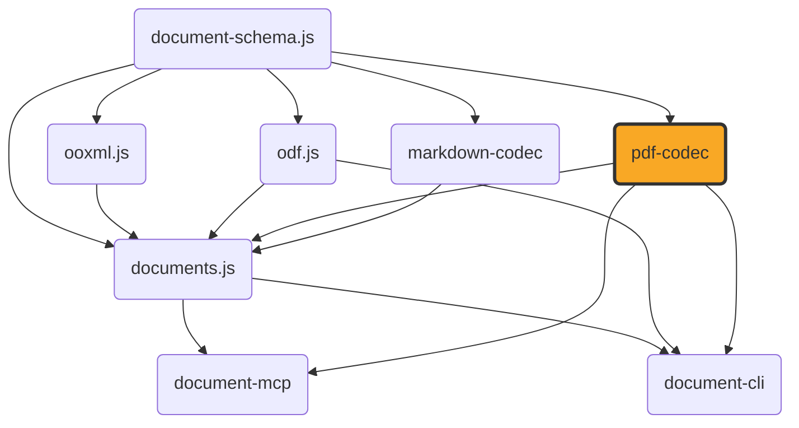

# pdf-codec

[](https://github.com/ExaDev/pdf-codec) [](https://www.npmjs.com/package/pdf-codec) [](https://github.com/ExaDev/pdf-codec/releases/latest) [](https://github.com/ExaDev/pdf-codec/actions)

> A hand-written, dependency-minimal PDF codec: parses arbitrary real-world PDFs into a structured, positioned-content document and generates new PDFs from one, built on [`document-schema.js`](https://github.com/ExaDev/document-schema.js)'s `LayoutDocument` pivot and [Zod 4](https://zod.dev) codecs.

`pdf-codec` is the PDF-reading-and-writing half of [`documents.js`](https://github.com/ExaDev/documents.js), extracted into its own package: every layer of the PDF format — the object model, the cross-reference table, the content-stream operators, standard-font metrics, the parser's cross-reference/object-stream resolution and content-stream interpreter — is hand-written against the ISO 32000-1 specification, with no external PDF library (`pdf-lib`, `pdfjs-dist`, `mupdf`, or any other) as a dependency. The one exception is [`fflate`](https://github.com/101arrowz/fflate) for raw DEFLATE/zlib compression underneath PDF's `FlateDecode` filter and PNG's `IDAT` chunks. The OpenType/CFF font parsing this package's own writer uses to embed a real math font (`sfnt.ts`/`math-*.ts`) is hand-written too, as are the cryptographic primitives its reader needs to open an encrypted PDF (`crypto/` — MD5, SHA-2, RC4, AES), for the same "no supply-chain surface beyond what's already declared" reason — and, for the crypto specifically, because `node:crypto` would end this package's platform neutrality and WebCrypto offers neither MD5 nor RC4 nor a synchronous API — the one bundled binary asset is the vendored STIX Two Math font itself (OFL-1.1, see [Fidelity](#fidelity) and `assets/fonts/NOTICE.md`), not a library.

That is a genuinely large undertaking — this codec is comparable in size to a small application in its own right — and it comes with an honest trade-off spelled out in [Fidelity](#fidelity) below: this is not, and does not attempt to be, as robust against adversarial or badly malformed real-world PDFs as a library with 15+ years of hardening. What it buys instead is a dependency-free, fully auditable PDF implementation with no supply-chain surface beyond `document-schema.js`, `fflate`, and `zod`.

`documents.js` uses this package to convert docx/pptx/odt/odp/ods/odg to and from PDF, and to render MathML formulas (typeset by its own `src/mathml/` engine) through the embedded math font this package parses and writes. That MathML *layout* engine deliberately stays in `documents.js` — see [Architecture](#architecture) below for exactly where the boundary between the two packages sits and why a real `MathBox` value crosses it with zero cast or wrapper.



## Getting started

Requires Node.js `>=20` and pnpm `11.6.0` (pinned via `packageManager` in `package.json`).

```sh
pnpm install
```

Install as a dependency in another project:

```sh
pnpm add pdf-codec
# or
npm install pdf-codec
```

## Usage

Reading and writing PDF bytes:

```ts
import { readPdf, writePdf } from 'pdf-codec';

const layout = readPdf(pdfBytes); // -> LayoutDocument: pages of positioned text/image/rect/line/ellipse/path/link items
const bytes = writePdf(layout);
```

An encrypted PDF that opens without a password decrypts transparently on the way through — there is no extra option, no password parameter, and no separate call; one that genuinely needs a user password throws `PdfPasswordRequiredError` instead. See [Gotchas](#gotchas-and-quirks) for exactly which encryption is supported and why no password can be supplied.

Both accept an optional `signal` (`AbortSignal`); `readPdf` additionally takes a `sink` (a `PdfDiagnosticSink`, called once per recoverable parse diagnostic — see the three-tier failure policy under [Conventions](#conventions)), and `writePdf` an `onSubstitution` callback, called once per character not representable in a standard-14 font (see [Fidelity](#fidelity)).

The same round trip is also available as a schema-validated [`z.codec()`](https://zod.dev) pair:

```ts
import { z } from 'zod';
import { pdfCodec } from 'pdf-codec';

const layout = z.decode(pdfCodec, pdfBytes); // throws a ZodError if pdfBytes has no %PDF- header
const pdfBytes2 = z.encode(pdfCodec, layout);
```

`z.decode` validates the input bytes against `PdfBytesSchema` (the `%PDF-` header) before parsing, and the parsed result against `LayoutDocumentSchema`; `z.encode` validates the reverse. This is the no-extra-options form only — `readPdf`/`writePdf` remain the entry points for cancellation, diagnostics, or substitution reporting, none of which fit `z.codec()`'s fixed `decode(input)`/`encode(output)` signature.

Embedding a real math formula: `writePdf`'s own `formulas` option takes an array of `PositionedFormula` — an already-laid-out `MathBox` (positioned glyph runs, fraction/radical rules, radical-hook strokes) placed at a page position. This package supplies the font — `loadMathFont()` parses and caches the vendored STIX Two Math font once per process, exposing per-size `MathFontMetrics` — but it does not lay MathML out itself; that is a separate concern this package deliberately doesn't own (see [Architecture](#architecture)). `documents.js`'s own `layoutFormula` is the typical producer of a `MathBox`:

```ts
import { loadMathFont, writePdf } from 'pdf-codec';
import { layoutFormula } from 'documents.js'; // or any other producer of a structurally-compatible MathBox

const { metricsAt } = loadMathFont();
const { box } = layoutFormula(mathml, { metrics: metricsAt(12), sizePt: 12, color: { r: 0, g: 0, b: 0 } });

const pdfBytes = writePdf(doc, { formulas: [{ pageIndex: 0, xPt: 50, yPt: 700, box }] });
```

Because `MathBox` and its own constituent types (`MathGlyphRun`/`MathRule`/`MathStroke`/`MathAssembledGlyphs`/`MathColor`) are plain, structurally-typed data — not a class, not branded — any producer whose output happens to match the shape works here with no cast, no wrapper, and no transformation, whether or not it imports this package at all.

Sizing a stretchy glyph — a parenthesis or brace tall enough to wrap a big fraction, a radical sign sized to its own radicand, an over-brace as wide as the content under it — is the OpenType `MATH` table's `MathVariants` job, and `loadMathFont()` exposes it directly. `stretchGlyph` takes a target extent in points and returns the glyph(s) to draw with each one's own offset along the stretch axis, already in points at the requested font size:

```ts
import { loadMathFont } from 'pdf-codec';

const { stretchGlyph } = loadMathFont();
const paren = stretchGlyph(0x28, 'vertical', 40, 12); // a '(' stretched to 40pt, set at 12pt
// paren.kind      -> 'assembly' (no single pre-built variant reaches 40pt)
// paren.size      -> the extent actually achieved, >= 40 whenever the font can reach it
// paren.placements -> [{ glyphId, offset, advance }, ...], bottom to top, seams already overlapped
```

Three outcomes are possible and `kind` records which happened: `'base'` when the unstretched glyph was already big enough, `'variant'` when one of the font's own pre-drawn larger glyphs was selected (always preferred — a hand-drawn glyph beats a glued-together one), and `'assembly'` when the construction was genuinely built by repeating the font's own extender piece between its end pieces, overlapping each seam by as much as both sides' declared connector lengths allow so the joined outlines meet cleanly. `offset` is measured along the stretch axis from the construction's own start — the bottom for a vertical construction, the left for a horizontal one. For a caller working in design units rather than points, `MathFont.stretchyConstruction(codePoint, axis)` returns the raw parsed `MathVariants` data and `assembleStretchyGlyph` performs the same computation over it.

A stretched construction is genuinely drawable, through `MathBox`'s own `MathAssembledGlyphs` item kind: a list of `{ glyphId, xPt, yPt }` placements addressed by **glyph ID**, not by Unicode text. That distinction is the whole point rather than a convenience — most of the glyphs a `MathVariants` construction names have no Unicode code point at all, so they could never travel through `MathGlyphRun.text`, which the writer resolves through the font's `cmap`. Every pre-built larger variant is unencoded, and so are the radical's and the over-brace's assembly pieces; the bracket family is the one exception, since Unicode gives its pieces dedicated code points (the U+239B–U+23AD block — which is also an independent confirmation that assembly parts really are listed bottom-first, given `LEFT PARENTHESIS LOWER HOOK` comes first and `UPPER HOOK` last). Drawing by glyph ID works regardless, because the composite font this package embeds is Identity-H with CID == GID (see [Gotchas](#gotchas-and-quirks)), so a bare glyph ID is directly showable with no `cmap` involvement.

The one thing a glyph ID cannot carry is meaning: an unencoded glyph gets no ToUnicode entry, so `MathAssembledGlyphs` also carries the operator's own original `text` (`"("`, `"["`), which `math-content-write.ts` emits as an `/ActualText` marked-content span around the whole construction. A tall assembled bracket therefore still extracts, searches, and copies as `(`.

`MathFontMetrics.stretch` is the layout-facing form of all this, and the one a layout engine actually calls: it resolves a construction at a target size and additionally **measures** it — `inkAscentPt`/`inkDescentPt` are the whole construction's real ink extent about its drawing origin, taken from actual glyph outlines. Without that a caller cannot place the result, since a construction's ink neither starts at its drawing origin (a large parenthesis variant straddles the baseline) nor is bounded by its advance-derived `size`.

Building a layout engine on top of this codec (this is what `documents.js`'s own `src/layout/` does for docx/pptx/odt/odp/ods/odg): `TextMeasurer`/`createStandardFontMeasurer` and `wrapRunsToWidth` answer "how wide does this text render, and where does this line break" against the standard-14 metrics; `resolveStandardFont`/`STANDARD_METRICS` map an arbitrary requested family/weight/style onto one of the 14 standard PDF faces and that face's own AFM-derived metrics; `rotatePointAboutCenter` handles shape-rotation placement math. None of these do any PDF I/O themselves — they're the same primitives `writePdf`/`readPdf` use internally, exported so a caller assembling its own `LayoutDocument` (from any source format) can measure and wrap text identically to how this package will actually render it.

Embedding real fonts instead of substituting standard-14 faces, via a `FontRegistry` (see `src/font-registry.ts` for the full source-document → caller-supplied → vendored-substitute → standard-14 resolution order). Pass the same registry to both the measurer and `writePdf`, so what was measured and what gets drawn come from one font:

```ts
import { createFontMeasurer, createFontRegistry, wrapRunsToWidth, writePdf } from 'pdf-codec';

// With no `fonts`/`sourceFonts` of its own, the registry still maps Calibri onto the vendored,
// metric-compatible Carlito face this package embeds (and Cambria onto Caladea).
const fonts = createFontRegistry();

const measurer = createFontMeasurer(fonts);
const lines = wrapRunsToWidth(runs, measurer, columnWidthPt);
// ... build a LayoutDocument from `lines` ...
const pdfBytes = writePdf(doc, { fonts, onMissingGlyph: (m) => console.warn('no glyph for', m.from) });
```

Every text run whose family resolves to a real face is subsetted to the glyphs the document actually uses and embedded as its own `/Type0` + `/CIDFontType2` + `/FontFile2` group; every run that resolves to a standard-14 face is written exactly as it always was. **Omit `fonts` and nothing changes at all** — no font program is embedded, every family resolves through `resolveStandardFont`, and the output is byte-identical to a build with no embedded-font support (asserted against golden digests in `src/write-embedded-font.test.ts`).

Inspecting a standalone font file before handing it to a `FontRegistry` as a `ProvidedFont`: a caller holding raw `.ttf`/`.otf` bytes (a user-supplied house font, say) rarely already knows the file's own family/bold/italic triple, and guessing one from a filename is unreliable. `readFontFace` reads it straight off the font's own `name`/`OS/2`/`head` tables — exactly the family+style pair `ProvidedFont` needs to resolve correctly, and a structurally different thing from `EmbeddedFace.postScriptName` (a naming convention like `"ArialMT"`, not a structured triple):

```ts
import { createFontRegistry, readFontFace } from 'pdf-codec';

const { family, bold, italic } = readFontFace(brandSansTtfBytes, 'BrandSans-Bold.ttf'); // throws FontFaceParseError, naming the source, for a .ttc/.woff file or one with no family name
const fonts = createFontRegistry({ fonts: [{ family, bold, italic, bytes: brandSansTtfBytes }] });
```

`createFontMeasurer`'s second argument carries `verticalMetrics`, a `VerticalMetricPolicy` of `'hhea'` (the default) / `'os2Typo'` / `'os2Win'`, deciding which of the three competing ascent/descent/line-gap sets an sfnt declares should drive line height for an embedded face. It is an explicit, overridable option rather than a baked-in rule because no specification settles the question — see `src/measure.ts` for what each policy reads and why `'hhea'` is the default.

Reading a JPEG 2000 image directly, either as pixels or as metadata alone:

```ts
import { decodeJpeg2000, readJpeg2000Metadata } from 'pdf-codec';

// Works on any conforming codestream -- including one whose pixels this decoder refuses, which is what `decodable`/`undecodableReason` are for.
const metadata = readJpeg2000Metadata(jp2OrCodestreamBytes);
console.log(metadata.width, metadata.height, metadata.transform, metadata.layers, metadata.decodable, metadata.undecodableReason);

const image = decodeJpeg2000(jp2OrCodestreamBytes); // -> { width, height, bitDepth, components: Int32Array[] }, one plane per component
```

Both accept a whole JP2 file or a bare codestream; `decodeJpeg2000` takes an optional `onWarning` for the recoverable cases (a truncated codestream decodes to whatever packets did arrive) and throws `Jpeg2000UnsupportedError` naming the feature for anything outside [JPEG 2000 scope](#jpeg-2000-scope). Inside a PDF none of this needs calling: `readPdf` decodes a `/JPXDecode` image XObject through the same path automatically.

The full `src/bytes/`/`src/image/` surface is exported too — `crc32`, `deflate`/`inflate`/`inflateTolerant`, `ByteReader`/`ByteWriter`/`concatBytes`, `readJpegInfo`, `decodePng`/`encodePng`, `unfilterScanlines`/`filterScanlines`, `decodeCcittFax`, `decodeJbig2Embedded`, `decodeJpeg2000`/`readJpeg2000Metadata`/`parseJp2Container` — generic byte- and image-container primitives with zero PDF-specific knowledge of their own, useful independently of anything PDF-related.

Every module under `src/` is also deep-importable directly by its own subpath, for a caller that wants one internal module (not part of the curated barrel above) without pulling in the rest:

```ts
import { crc32 } from 'pdf-codec/bytes/crc32';
import { readJpegInfo } from 'pdf-codec/image/jpeg-info';
```

This works via package.json's `"./*"` wildcard export, resolving any `pdf-codec/<path>` subpath to the correspondingly-named file under `dist/` — both ESM `import` and CJS `require` resolve the same way.

## Architecture

The package is layered from generic primitives outward to the codec itself:

- **`src/math-types.ts`** and **`src/formula.ts`** — a local, structurally-compatible mirror of `documents.js`'s own `src/mathml/layout-types.ts` + `src/mathml/metrics.ts` (`MathColor`/`MathGlyphRun`/`MathRule`/`MathStroke`/`MathLayoutItem`/`MathBox`/`MathGlyphMetrics`/`MathFontMetrics`, including the latter's own `glyph()` method signature) and `src/model/formula.ts`'s `PositionedFormula`. Deliberately not imported from `documents.js` — that would be a circular dependency once `documents.js` depends on this package for `readPdf`/`writePdf` — the same "mirror the shape, don't import the package" trick this whole family already uses elsewhere (`odf.js`'s own `MathMlNode` mirrors `ooxml.js`'s `XmlNode` rather than importing it). Because every one of these types is plain data (only `MathFontMetrics` carries a method), a real `MathBox` value `documents.js`'s own MathML layout engine produces passes into `writePdf({ formulas })` with zero cast, zero wrapper, and zero transformation.
- **`src/bytes/`** and **`src/image/`** — generic byte and image-container primitives with zero PDF-specific knowledge: a chunked byte writer, a backtracking byte reader, CRC32, and a hand-written PNG decoder/encoder (palette/gray/RGB/alpha, multi-`IDAT` files, all five scanline filters) plus JPEG marker scanning for dimensions only — JPEG's compressed bytes pass through completely unchanged in both directions — and a hand-written CCITT Group 3/Group 4 fax decoder (ITU-T T.4/T.6), which knows nothing of PDF: `src/filters.ts` reads the `/CCITTFaxDecode` parameter dictionary and hands it plain options, and the identical bitstreams are what TIFF's own Group3Options/Group4Options describe. `src/image/jbig2*.ts` is a hand-written JBIG2 decoder (ITU-T T.88) built to the same rule — `jbig2-arith.ts` (the MQ arithmetic decoder of Annex E plus the integer and symbol-ID procedures of Annex A), `jbig2-bitmap.ts` (the bi-level bitmap and the five region composition operators), `jbig2-generic.ts` (generic and refinement region decoding), `jbig2-text.ts` (symbol dictionaries and text regions), and `jbig2.ts` (segment framing and page composition) — with `src/filters.ts` again owning every piece of PDF knowledge involved, namely resolving `/JBIG2Globals` and inverting JBIG2's own black-is-1 polarity to what a 1-bit `/DeviceGray` image expects. `src/image/jp2-boxes.ts` and `src/image/jpeg2000*.ts` are a hand-written JPEG 2000 decoder (ISO/IEC 15444-1 / ITU-T T.800) built the same way — `jp2-boxes.ts` (the JP2 file format's box structure of Annex I), `jpeg2000-codestream.ts` (the marker segments of Annex A), `jpeg2000-tagtree.ts` (the stuffed-bit packet-header reader and the tag tree of B.10), `jpeg2000-t2.ts` (the tile/resolution/precinct/code-block geometry of Annex B and packet decoding), `jpeg2000-t1.ts` (the EBCOT bit-plane coding passes of Annex D, driving the same MQ decoder `jbig2-arith.ts` already owns, since T.800 Annex C and T.88 Annex E specify one identical coder), `jpeg2000-dwt.ts` (the inverse wavelet of Annex F), and `jpeg2000.ts` (the whole pipeline plus the component transform and DC level shift of Annex G) — with `src/images-read.ts` rather than `src/filters.ts` owning the PDF knowledge this time, because a JPEG 2000 codestream's component count and sample depth come from the codestream rather than from the image dictionary and only the image layer has anywhere to put them. `src/bytes/flate.ts` is the only file that imports `fflate`.
- **`src/util/`** — two small, independently-duplicated copies of logic that lives elsewhere in the family for a reason narrow enough not to warrant a shared dependency: `base64.ts` (isomorphic base64 ⇄ `Uint8Array`, a verbatim copy of `odf.js`'s own `src/util/base64.ts`, replacing a dependency this codec used to have on `ooxml.js` purely for this one helper pair) and `abort.ts` (`throwIfAborted`, a four-line signal-check helper called at every page loop boundary in `write.ts`/`read.ts` — there is no `await` point in this package's synchronous reader/writer pipeline for cancellation to hook into implicitly, so every long-running loop checks explicitly instead; a duplicate of `documents.js`'s own `src/ports/abort.ts`, which stays there since other, non-PDF consumers still depend on it in that repository).
- **`src/crypto/`** — MD5, SHA-256/384/512, RC4, and AES-CBC, hand-written with zero local imports, exactly like `src/bytes/`. Not a preference: ISO 32000-1's own key-derivation algorithms name MD5 and RC4 directly, neither of which any platform crypto API this package could portably reach still offers, and `crypto.subtle` is asynchronous where this codec's read path is synchronous end to end. Reaching for `node:crypto` would put a Node builtin inside a `src/` tree that deliberately has none and is built with `platform: 'neutral'`, breaking the browser bundle its downstream consumer depends on. Each module cites the specification it implements (RFC 1321, FIPS 180-4, FIPS 197) and is tested against that specification's own published conformance vectors. MD5 and RC4 are cryptographically broken and are here solely to *read* files that already exist and whose format mandates them.
- **The codec itself, importing only `math-types`/`formula`/`bytes`/`image`/`crypto` (no OOXML or ODF knowledge at all):**
  - **Write**: `objects.ts` (the `PdfObject` discriminated union), `afm-widths.ts`/`encoding.ts`/`winansi.ts`/`fonts.ts` (standard-14 metrics, WinAnsi encoding, family resolution), `font-registry.ts` (the source-document → caller-supplied → vendored-substitute → standard-14 resolution port sitting in front of `resolveStandardFont`, plus `resolveFaceWithRegistry`, the one step both the measurer and the writer resolve through so they can never disagree about which face a `LayoutFont` means), `font-face.ts` (`readFontFace`, a thin public wrapper over `sfnt.ts`'s `parseSfnt` and `font-tables.ts`'s `parseName`/`parseOs2`/`parseHead` reading a standalone font *file*'s own family/bold/italic triple straight off its `name`/`OS/2`/`head` tables — what a caller assembling `ProvidedFont` candidates for `FontRegistry` needs, and a different job from `embedded-font.ts`'s already-public `EmbeddedFace.postScriptName`, which is a naming convention rather than a structured family+style pair), `measure.ts`/`text-layout.ts` (greedy line-wrapping, measured against either a standard-14 face's AFM widths plus a per-family correction or a resolved face's own real `hmtx` advances — never both, see [Fidelity](#fidelity)), `matrix.ts`, `content-write.ts` (`LayoutItem[]` → content-stream operators, with text branching on whether its font resolved to a standard-14 face shown as a WinAnsi byte string with `Tj` or an embedded one shown as Identity-H 2-byte CIDs, split at that face's own pair-kerning adjustments into a `TJ` array where it has any to apply and shown as a single unsplit `Tj` string where it does not, and with a stroked line's or path's own `style` becoming either a real dash-array/line-cap state pair around the paint operator or, for `double`, two perpendicular-offset copies of the geometry — see [Gotchas](#gotchas-and-quirks)), `write.ts` (the full object graph, classic cross-reference table, trailer, and — when `WritePdfOptions.formulas` is non-empty — one embedded math composite font group, plus one embedded text font group per face `WritePdfOptions.fonts` resolved, each allocated once in a fixed sorted order and shared across pages).
  - **sfnt font tables**: `sfnt.ts` (a bounds-checked sfnt table-directory reader, big-endian primitive readers, and the `hasBytes` range check every table parser below pre-checks with), `cmap-table.ts` (Unicode → glyph ID, formats 4/12/6), `hmtx-table.ts` (per-glyph advance widths), `font-tables.ts` (`head`/`maxp`/`OS/2`/`post`/`name` — design grid, glyph count, vertical metrics and style bits, italic angle and underline geometry, PostScript and family names), `glyf.ts` (the `loca` offset index, per-glyph headers, a composite glyph's own component records — a composite refers to its base letter and combining marks by glyph ID, and those references nest, so subsetting one safely means taking the transitive closure over this walk — and `glyphInkBounds`, a glyph's own tight ink box, read straight out of a simple glyph's header where the format already states it and unioned from a composite's own transformed, placed components where it does not), and `math-table.ts` (the OpenType `MATH` table's constants, glyph-info, and variants subtables). `ot-layout-common.ts` holds the two Common Table Formats every OpenType Layout table indexes glyphs through — Coverage and ClassDef — stored as sorted glyph ranges and searched by bisection rather than expanded into a glyph-keyed map, since six bytes of a format 2 record can legitimately declare a 65536-glyph range and expanding every range of every subtable turns a small untrusted font into a large allocation. `gpos-table.ts` reads a face's own `GPOS` table for exactly one thing: how much the font wants the advance of glyph A adjusted when glyph B follows it. It resolves the `kern` feature through the ScriptList (rather than sweeping the FeatureList for every feature tagged `kern`, which is what would apply a font's Cyrillic or Greek kerning lookups to Latin text), handles both PairPos subtable formats and the LookupType 9 Extension indirection — all three are real code paths, since Carlito reaches its kerning only through Extension-wrapped format 2 subtables while Caladea uses LookupType 2 directly and mixes formats inside one lookup — and reads only the first glyph's XAdvance, the one field a horizontal left-to-right run's next glyph position can depend on. Mark attachment, cursive joining, and contextual positioning have no consumer in a codec that positions glyphs itself, so they are not parsed. Every one of these parsers degrades to `undefined` on a missing or truncated table rather than throwing: the vendored fonts are trusted, but a font extracted from an arbitrary source document is not.
  - **sfnt subsetting**: `sfnt-subset.ts` (a TrueType-outline glyph subsetter: Unicode code points → glyph IDs through `cmap-table.ts`, the transitive closure over `glyf.ts`'s composite-component walk, then a rebuilt sfnt container carrying only those glyphs' outlines). **Glyph IDs are preserved, never renumbered** — an unused ID below the highest used one survives as an empty `loca` entry rather than being squeezed out — which keeps every composite's own component references correct inside bytes copied verbatim, keeps a caller's already-resolved glyph IDs valid against the subset, and makes CID == GID trivially true for the embedded program (a `/CIDFontType2` then needs only `/CIDToGIDMap /Identity`). The output rebuilds `head`/`hhea`/`maxp`/`loca`/`glyf`/`hmtx` (with `indexToLocFormat` forced long, one always-legal code path), copies the hinting programs (`cvt `/`fpgm`/`prep`) verbatim, stubs `post` as a version 3.0 "no glyph names" header, and omits `cmap`/`name`/`OS/2`/`GSUB`/`GPOS`/`kern` — none of which an embedded `CIDFontType2` program is read through (ISO 32000-1 9.9). Dropping `GPOS` costs the document no kerning even though its pairs are now genuinely applied: the adjustments are resolved at write time and written into the page's own `TJ` array, so a consumer reads them off the content stream rather than out of the font program. The honest cost of preserving IDs: `loca` and `hmtx` stay proportional to the highest used glyph ID rather than to the number of glyphs kept, so for a document touching one glyph near the end of a large font's glyph order, most of the (already much smaller) output is those two index tables rather than outline data. Applies to `glyf`-flavoured fonts only; a CFF-flavoured one returns `undefined`, the same scope boundary [Fidelity](#fidelity) states for the embedded math font.
  - **Embedded math font**: `math-font.ts` (parses and caches the vendored STIX Two Math font once per process, exposing a size-specific `MathFontMetrics` implementation and a points-in/points-out stretchy-glyph entry point), `math-stretch.ts` (the OpenType MATH two-stage stretching model over that parsed `MathVariants` data: pick the smallest pre-built variant that reaches the target, else assemble from repeated parts with every seam overlapped inside both sides' own declared connector lengths -- unit-agnostic, so it works in design units or points alike), `math-font-write.ts` (builds the `/Type0`/`/CIDFontType0`/`/FontDescriptor`/`/FontFile3`/ToUnicode object group), `math-content-write.ts` (a `PositionedFormula[]` → PDF content-stream bytes, Identity-H 2-byte CIDs for text-showing, `re`/`m`/`l` operators for rules and the radical hook, and one glyph-ID-addressed text object per placement of a stretched construction, wrapped in an `/ActualText` marked-content span). See [Fidelity](#fidelity) for the CFF-full-embed (not glyph-subsetted) simplification this makes.
  - **Embedded text faces**: `embedded-font.ts` (parses and caches one TrueType-outline face's `cmap`/`hmtx`/`hhea`/`head`/`OS/2`/`post`/`name` metrics and its own `GPOS` pair kerning, and `encodeForShowEmbedded`, the single code path both measurement and text-showing go through — the same reason `winansi.ts`'s `encodeForShow` exists, since encoding and measuring separately lets the two disagree about which characters resolved to which glyph and silently desyncs a computed wrap point from the drawn line). Pair kerning is applied inside that same one path, for that same one reason: one pass over one glyph sequence produces both the run's width and the list of adjustments `content-write.ts` positions its glyphs by, so a measurement that included kerning while the page drew unkerned glyphs (or the reverse) is not a state this can reach. Kerning is looked up between the glyphs that will actually be shown, `.notdef` included, matching the same "measure what will be drawn, not what was asked for" rule the missing-glyph handling already follows. Every geometry field it exposes is converted into PDF's 1000-units-per-em glyph space (ISO 32000-1 9.8.1), which a font's own design grid frequently is not: STIX Two Math is drawn on a 1000-unit em so that factor is an identity for the math font, but Carlito is drawn on a 2048-unit em, where getting the conversion wrong is silent rather than loud — the font simply renders with roughly twice its intended metrics and nothing anywhere reports an error. The serif flag a `/FontDescriptor` needs is read off the face's own PANOSE classification rather than guessed from its family name. `embedded-font-write.ts` builds the `/Type0`/`/CIDFontType2`/`/FontDescriptor`/`/FontFile2`/ToUnicode object group, with `/CIDToGIDMap /Identity` written explicitly (stating outright the CID == GID invariant `sfnt-subset.ts`'s GID-preserving design guarantees) and `/Length1` set to the **uncompressed** subset length — the single most commonly mis-set key in TrueType embedding, since the obvious-looking value, the stream's own `/Length`, is silently accepted by lenient readers and rejected by strict ones. Its subset tag (`ABCDEF+Carlito-Regular`, six uppercase letters per 9.6.4) is a CRC32 over the face's PostScript name and its exact ascending glyph-ID list, so identical input yields byte-identical output and two subsets of one face carrying different glyphs can never be mistaken for one another.
  - **ToUnicode CMaps**: `tounicode.ts`, shared by both embedded-font writers above rather than duplicated in each — a character code → Unicode code point mapping written as a bfchar CMap (9.10.3), with supplementary-plane code points encoded as genuine UTF-16BE surrogate pairs and entries emitted in blocks of at most 100, the limit the CMap syntax sets and one a subsetted text face routinely exceeds. A glyph with no code point to map back to (a stretchy construction's own unencoded pieces) is dropped from the CMap rather than mapped to a stand-in that would extract as the wrong character; the `/ActualText` span around such a construction carries its real text instead.
  - **CFF reading**: `cff.ts` holds the two container structures every CFF program is built out of — the `INDEX` and the `DICT` — shared by the two readers built on it rather than hand-rolled twice. `cff-bounds.ts` is a Type 2 charstring interpreter that computes each glyph's own tight ink bounding box: a CFF glyph, unlike a TrueType one, stores no bounding box anywhere, so the only way to know what area it covers is to run its outline program. It is a path *walker*, not a rasteriser — it tracks the current point through every path-construction operator and solves each cubic's real extrema from the roots of its own derivative, so a bound it reports is genuinely tight rather than a control-point hull. Hint operators are decoded only far enough to know how many bytes a following `hintmask` consumes. Verified against the vendored STIX Two Math font's whole 5,543-glyph repertoire: every glyph matches fontTools' own `BoundsPen` to within 0.01 design units, and the union of all 5,543 computed boxes lands exactly on the font's own `head` table `FontBBox`. Out of scope, each reported as `undefined` rather than guessed at: a CID-keyed program (its local subroutines live per-FD behind `FDArray`/`FDSelect`), `endchar` in its four-argument seac-like form (which needs the charset and Standard Encoding to resolve into two other glyphs), and the arithmetic/storage/conditional escaped operators. `cff-probe.ts` reads a bare CFF program's header, Name INDEX, and just enough of its Top DICT to detect the `ROS` operator (the escaped `12 30` whose presence *is* the definition of a CID-keyed font, CFF 1.0 Appendix H). It exists to make the embedding path **refuse** such a font rather than mis-embed it: a CID-keyed CFF carries its own charset mapping CIDs onto glyph indices, so CID == GID does not hold, and showing text through Identity-H against one anyway produces no error anywhere — the file is structurally valid, every reader accepts it, and the page simply renders the wrong glyphs. Not wired into any write path yet; it is the guard a later source-embedded-font phase needs. It correctly reports the vendored STIX Two Math font's own `CFF ` table as *not* CID-keyed, which is what makes `math-font-write.ts`'s existing embedding sound.
  - **Read**: `lexer.ts`/`parse.ts` (byte tokenizer and tokens → `PdfObject`), `filters.ts`/`predictors.ts` (Flate/LZW/ASCII85/ASCIIHex/RunLength/CCITTFax, TIFF/PNG predictors), `xref.ts`/`document.ts` (classic and cross-reference-stream resolution, object streams, `/Prev` chains, linear-scan recovery, the page tree with attribute inheritance), `encrypt.ts` (the standard security handler: `/Encrypt` parsing, empty-user-password key derivation and `/U` verification, per-object keys, and the string/stream decryption `document.ts` applies transparently as each indirect object is fetched — see [Gotchas](#gotchas-and-quirks)), `content-read.ts`/`interpret.ts` (the content-stream tokenizer and graphics/text state machine, including form-XObject recursion and general vector-path tracking — see [Gotchas](#gotchas-and-quirks)), `cmap.ts`/`font-style.ts`/`font-read.ts` (`/ToUnicode` CMaps, font-dictionary resolution), `images-read.ts` (Image XObjects → PNG/JPEG bytes), `read.ts` (`readPdf`, assembling all of the above into a `LayoutDocument`).
  - `codec.ts` — `pdfCodec`, a `z.codec()` pair over `readPdf`/`writePdf`, plus a standalone, ~20-line local copy of just the `%PDF-` header check `PdfBytesSchema` needs (`documents.js`'s own equivalent schema lives in a file that also carries unrelated docx/pptx/odt schemas that have no place here).
- **`src/test-support/pdf.ts`** — hand-built PDF fixtures for the parser's own tests (a classic-xref file, an xref-stream-with-object-streams file, a broken-`startxref` file needing linear-scan recovery, an incremental update, a trailer naming a security handler no password could open, and more), built by literal byte/string concatenation and deliberately importing NOTHING from this package's own writer — a fixture built by calling `writePdf` would let a writer bug hide from the corresponding reader test and vice versa. Not part of the public surface; test-only.
- **`src/test-support/encrypted-pdfs.ts`** — the same independence principle applied to encryption: real PDFs encrypted by [qpdf](https://qpdf.sourceforge.io/), embedded as base64 and regenerated by `node scripts/generate-encrypted-pdf-fixtures.mjs`. One fixture per supported cipher, plus password-protected counterparts and an `/EncryptMetadata false` variant. Encrypted by a mature outside implementation on purpose — a fixture this package encrypted itself would let a bug in key derivation or in a cipher cancel out between the write and read halves and pass anyway.
- **`src/test-support/fonts.ts`** — the real vendored Carlito and Caladea faces as raw sfnt bytes (inflated from the embedded `src/assets/` modules, so the suite stays filesystem-free), for the `sfnt.ts`/`cmap-table.ts`/`font-tables.ts`/`glyf.ts`/`sfnt-subset.ts`/`embedded-font.ts` tests. Those tests assert values read out of the `.ttf` files by a standalone script with a bare `DataView`, not by this package's own parsers, so they are external cross-checks rather than a parser's output compared against itself. `sfnt-subset.test.ts` applies the same principle to the container it writes: a real face is subsetted down to one short string's glyphs, read back through this package's own parsers for outline/advance identity, and its table directory, alignment, and every checksum (including `head`'s `checkSumAdjustment`) verified by a second reader written with a bare `DataView` rather than by `parseSfnt`. The two families are also a deliberately matched pair for the glyph-space conversion above: Carlito's 2048-unit em makes every conversion a real scaling and Caladea's 1000-unit em makes it the identity, so a bug that skipped the scale would pass every Caladea assertion and fail every Carlito one. `embedded-font-write.test.ts` closes the loop end to end — a real face, a real subset, the full object group, a complete hand-assembled PDF file with a real cross-reference table, read back through this package's own `readPdf` to recover the drawn text, its measured width, and the face family, plus an object-level check that the `/FontFile2` stream inflates back to exactly the subset bytes and that `/Length1` states their pre-compression length.

Dependency direction is strictly downward and checkable: `math-types`/`formula`/`bytes`/`crypto`/`util` import nothing local (`bytes/flate.ts` imports `fflate`); `image` imports `bytes` only; the codec itself imports `math-types`+`formula`+`bytes`+`image`+`crypto`+`util` only. Nothing anywhere under `src/` imports a `node:` builtin, which is what lets `tsdown`'s `platform: 'neutral'` build run unchanged in a browser bundle. No `PdfObject`/`PdfDict`/`PdfStream` type appears outside the codec's own read/write modules — it never crosses a public boundary and is constructed exclusively by this package's own parser.

## Conventions

- **Zod-first schema/type/guard**: `PdfBytesSchema`/`LayoutDocumentSchema` (the latter imported from `document-schema.js`) are the only two schemas this package validates against; every other model type (`PdfObject`, `MathBox` and friends) is plain TypeScript, never Zod-validated, for reasons specific to each — see the next two bullets.
- **`z.codec()` for the one schema-to-schema round trip this package owns**: `pdfCodec` (PDF bytes ⇄ `LayoutDocument`), wrapping the already-independently-tested `readPdf`/`writePdf` pair and adding automatic two-way schema validation. Deliberately the no-options form — `readPdf`/`writePdf` remain the primary entry points wherever a caller needs an `AbortSignal`, a `PdfDiagnosticSink`, or an `onSubstitution` callback, since `z.codec()`'s fixed `decode(input)`/`encode(output)` signature has no room for side-channel options.
- **`PdfObject` has no Zod schema at all**, deliberately: it never crosses a public boundary or round-trips through JSON, and is constructed exclusively by this package's own parser — validating it would just be validating our own output. It narrows natively on its own `kind` discriminant instead.
- **The `MathBox`/`MathFontMetrics` family is structurally typed on purpose, not validated by Zod either.** This is the mechanism that lets a caller (`documents.js`) hand this package a real value produced by a completely independent module, with zero cast, zero wrapper, and no shared class or branded type — see [Architecture](#architecture).
- **No type assertions anywhere.** Every third-party or loosely-typed value is narrowed through a type guard or a Zod parse at the boundary.
- **A three-tier PDF-read failure policy**, applied consistently across every read module: throw a typed `PdfParseError`/`PdfEncryptedError`/`PdfPasswordRequiredError` for a file that cannot be meaningfully processed at all; recover with a `PdfDiagnostic` (`severity: 'warning'`) for something malformed but salvageable (a bad `startxref`, a wrong stream `/Length`); degrade with a diagnostic for an individual unsupported feature (an unimplemented filter, an unrecognised colour space) while the rest of the document still reads.
- **Conventional commits**, enforced via commitlint + husky.

## Gotchas and quirks

- **Reading arbitrary real-world PDFs is the single largest risk surface in this package**, and the parser is honest about its design target: cleanly-generated output from mainstream producers (Word, PowerPoint, Chrome, LibreOffice, Acrobat), recovering from the malformations those producers and their downstream tooling actually create, and failing loudly and specifically on anything else — not matching a mature library's robustness against adversarial input.
- **An encrypted PDF is readable when, and only when, it opens without a password.** That is the overwhelmingly common real-world case — a permissions-only file, exported with "no printing" or "no copying" set, whose owner password may well be set but whose *user* password is empty. `readPdf` derives the file key from the empty user password, verifies it against the `/Encrypt` dictionary's own `/U` entry, and decrypts every string and stream transparently; nothing downstream of the object store knows the file was encrypted at all. Supported: `/Filter /Standard` at `/V` 1, 2, 4, and 5 — RC4-40, RC4-128, AES-128 (`/CFM /AESV2`) and AES-256 (`/CFM /AESV3`) — including `/EncryptMetadata false` and `/Identity` crypt filters. A file that genuinely needs a user password throws `PdfPasswordRequiredError`, its own distinct error, because "supply the password" and "this codec cannot read this at all" are different things to tell a user and only one of them can be acted on. Anything else — a non-standard (public-key) security handler, the unpublished `/V 3` algorithm, an unrecognised `/CFM` — still throws `PdfEncryptedError`.
- **Nothing in this codec accepts, prompts for, or guesses a password.** There is no password parameter on `readPdf`, and no owner-password path: authenticating as owner is a permissions escalation, not a way to read a file you were already allowed to read. Decryption is here to open files that are already open, not to get into ones that are not.
- **`CCITTFaxDecode`, `JBIG2Decode` and `JPXDecode` images all decode for real.** `src/image/ccitt.ts` is a hand-written ITU-T T.4/T.6 fax decoder — Group 4 (`/K < 0`, the modern default and the overwhelming majority of scanned-PDF usage), Group 3 one-dimensional (`/K = 0`), and Group 3 mixed (`/K > 0`) — producing a real packed 1-bit-per-pixel bitmap that the rest of `images-read.ts` then treats exactly like any other 1-bit `/DeviceGray` raster, `/Decode` inversion and all. `/Columns`, `/Rows` (falling back to the image's own `/Height`), `/BlackIs1`, and `/EncodedByteAlign` are honoured; the uncompressed-mode extension code is not, and a stream that stops making sense degrades to the rows already recovered plus a `pdf/ccitt-fax-degraded` diagnostic rather than throwing. `src/image/jbig2*.ts` is a hand-written ITU-T T.88 decoder covering what real scanned PDFs actually contain — see [JBIG2 scope](#jbig2-scope) below for exactly what is and is not implemented. `src/image/jpeg2000*.ts` is a hand-written ISO/IEC 15444-1 decoder covering both wavelets and the tiling, layering and precinct structure real files use — see [JPEG 2000 scope](#jpeg-2000-scope) below for exactly what is and is not implemented, and for the parts that are refused by name rather than approximated. JPEG images (`DCTDecode`) pass through completely losslessly in both directions; PNG-sourced images go through a real, narrowly-scoped hand-written codec.
- **`interpret.ts` tracks general vector paths, not just axis-aligned `re` rectangles.** `m`/`l`/`c`/`v`/`y`/`h` (and `re` itself, per its own ISO 32000-1 definition as a 4-point rectangle subpath) accumulate real subpaths — CTM-transformed line/cubic segments, open or closed — and any paint operator (`f`/`F`/`f*`/`S`/`s`/`B`/`B*`/`b`/`b*`) emits an item built from them. Verified both by dedicated tests and by a genuine `writePath` → `writePdf` → `readPdf` round trip recovering the original `LayoutPath` value exactly. This is the shared infrastructure a caller reconstructing structure from a `LayoutDocument` (a spreadsheet grid, a vector drawing) builds on.
- **A recovered path that matches one of three characteristic shape patterns comes back as that shape's own kind, not as a generic `LayoutPath`.** PDF has exactly one shape operator, `re`, and no ellipse or line operator at all, so a writer has no way to record what a path *was* — `interpret.ts` recovers it from the geometry instead. A single closed four-corner subpath whose every edge runs along one axis is a `LayoutRect` (so `re` under a non-rotated *or* 90°-rotated CTM, a hand-built `m`/`l`/`l`/`l`/`h` rectangle, and any combination of fill and stroke all reach it — not just the fill-only single-`re` case an earlier fast path covered); a closed subpath of exactly four cubic segments meeting at its bounding box's four cardinal points, with all eight control points at the standard kappa offset (`BEZIER_KAPPA`, 4/3·(√2−1)) those extremes imply, is a `LayoutEllipse` — precisely what `writeEllipse` emits; an open single-straight-segment stroke-only subpath is a `LayoutLine`. Tolerance is `max(1e-3pt, 1e-4 × the shape's own extent)`: the absolute floor is twenty times the 5e-5pt quantisation `formatNumber`'s 4-decimal-place rounding imposes, and the relative term is what lets a large ellipse from a producer that rounded its kappa constant more coarsely (`0.5523`) still match. **These are deliberate, bounded heuristics, not certainties** — a hand-authored freeform path that happens to consist of four kappa-ratio cubics between its bounding box's cardinal points is indistinguishable from a "real" ellipse in the PDF bytes, because at that point it geometrically *is* one, whatever the author called it. What a false positive can never do is misreport geometry: every detected shape reproduces its source path's own points exactly, so it changes an item's kind, never where or how big it is. Anything the patterns don't cover — a non-90° rotation, a curve that isn't the four-quadrant construction, a polygon that isn't a rectangle, multiple subpaths — stays a `LayoutPath`, and a rotated ellipse deliberately does too, since `LayoutEllipse` carries no rotation to report one with.
- **`writePdf`/`readPdf` round-trip a page's own `notes` field via a hidden annotation, not any real PDF feature.** PDF has no native concept of hidden presenter notes, so a page's `LayoutPage.notes` (when present) is written as a `/Subtype /Text` annotation (the same construct Acrobat's own sticky-note tool uses) with the `Hidden` annotation flag set so it never renders or prints, and `readPdf` reads it back via an internal author marker that distinguishes this package's own notes annotation from a genuine third-party sticky note. This is a round-trip mechanism specific to this package's own writer/reader pair — a PDF produced by anything else will never carry it, and a PDF consumer other than this package's own `readPdf` will never see it as anything but an invisible, empty sticky note. `documents.js` uses this to carry pptx/odp speaker notes through `pptxToPdf`/`pdfToPptx` and `odpToPdf`/`pdfToOdp`.
- **STIX Two Math (the embedded formula font) is a CFF-flavoured OpenType font (an `OTTO` sfnt wrapping a `CFF ` table), not TrueType/glyf** — confirmed by inspecting the vendored font's own sfnt table directory while `math-font.ts` was built. Genuine Type2-charstring glyph subsetting (re-encoding charstrings, rebuilding the CFF `INDEX` structures with a renumbered, minimal glyph set) is a substantially larger undertaking than TrueType glyf/loca subsetting, and is out of scope: the **entire** `CFF ` table is embedded verbatim, unmodified, as a single `/FontFile3` `/Subtype /CIDFontType0C` stream — a real, correct, working embedded font, just not glyph-subsetted. Everything else genuinely IS built from a targeted parse of only what's used: `cmap` resolves exactly the Unicode code points a document's formulas actually reference to glyph IDs, and the emitted `/W` widths array covers only the glyph IDs actually drawn (those, plus any unencoded pieces a stretchy construction contributed), not the font's full ~5,500-glyph repertoire; the ToUnicode CMap covers the subset of those that have a code point at all. A CID-keyed composite font built this way needs no `/CIDToGIDMap` at all (that key exists only for `/CIDFontType2`): per ISO 32000-1 9.7.4.2, a `/CIDFontType0` whose `/FontFile3` is a "bare" (non-CID-keyed) CFF program is read with CID treated as directly indexing the CFF's own `CharStrings` INDEX by glyph order — i.e. CID == GID, exactly the numbering `cmap`-derived glyph IDs already use, so Identity-H text-showing needs no further remapping anywhere in the write path.
- **The OpenType `MATH` table's `MathVariants` subtable is parsed, its stretchy-glyph assembly implemented (`math-table.ts`/`math-stretch.ts`), and the result genuinely drawable (`math-types.ts`'s `MathAssembledGlyphs`, `math-content-write.ts`).** Variant selection and part assembly are real, tested computation — `loadMathFont().stretchGlyph(...)` gives back the glyph IDs and offsets for a parenthesis, brace, radical sign, or over-brace at any target size, with every seam overlapped inside the parts' own declared connector lengths — and `MathFontMetrics.stretch` wraps that with the real ink measurement a layout engine needs to place it. Drawing goes by **glyph ID**, because most of the glyphs a construction names have no Unicode code point at all: every pre-built larger variant is unencoded, as are the radical's and the over-brace's assembly pieces, with the bracket family the one exception (Unicode's own U+239B–U+23AD piece block covers it). That works because CID == GID here, so a glyph ID is shown directly with no `cmap` involvement. Two real consequences follow, both handled rather than left silent: `collectUsedGlyphs` now maps a glyph ID to `number | undefined`, so an unencoded glyph still gets its `/W` width but contributes no ToUnicode entry, and the construction is wrapped in an `/ActualText` marked-content span carrying the operator's own text so it still extracts as `(` rather than as nothing. `MathConstants` (every fraction/radical/script-positioning constant `MathFontMetrics` exposes) and `MathGlyphInfo` (italics correction, top-accent attachment) are genuinely parsed in full too.
- **What this package draws for a stretchy glyph is decided entirely by its caller.** This package resolves and draws whatever construction it is asked for, on either axis; which operators a document actually stretches, and to what, is a layout-engine decision — `documents.js`'s own `src/mathml/layout.ts` currently stretches vertical fences in an `mrow` and nothing else. See that package's own README for which constructions genuinely stretch today and which still render at a fixed size.
- **Real per-glyph ink bounds are now measured from the outline, but `ascentPerEm`/`descentPerEm` still exist alongside them and a caller has to choose.** `MathGlyphMetrics.inkAscentPt`/`inkDescentPt` (and `MathFont.glyphInkBounds`, the same thing in design units) carry each glyph's own tight ink extent, computed by walking its Type 2 charstring — a full stop measures 0.12 em tall against the 1.0 em the font's nominal `hhea` metrics claim for every glyph alike. `ascentPerEm`/`descentPerEm` remain what they always were: one uniform figure for the whole face, still the right measure for anything sized against the font rather than against particular characters, and still the fallback for a glyph with no outline to measure (a space) or one `cff-bounds.ts` declines to walk, where both ink fields come back `undefined` together. The consumer that motivated this — `documents.js`'s own MathML `layoutToken` — now uses them: it takes the max ink ascent and max ink descent across a run's glyphs, falling back to the nominal metrics per glyph that carries no bounds.
- **An ink box is genuinely tight, which for a math font means it is often *larger* than the nominal metrics, not smaller.** The "ink is a fraction of the nominal extent" intuition holds for text-like glyphs (a full stop, a parenthesis, an `x`) and fails for the extension pieces, display-size operators, and pre-built large variants a math font is full of: over a tenth of STIX Two Math's repertoire draws above its own nominal ascent, and another tenth below its nominal descent, reaching 2.6 em up and 1.6 em down at the extremes. Sizing those from `ascentPerEm` under-reports them exactly as badly as it over-reports a full stop, which is the whole reason the per-glyph measurement exists.
- **A glyph's ink descent is negative where its lowest ink sits above the baseline.** `inkDescentPt` follows `descentPerEm`'s own sign convention (ink below the baseline is a positive descent), so a superscript-height glyph honestly reports a negative descent rather than a clamped zero. A consumer that needs a box which never crosses the baseline clamps at its own layer, where it can see what the box is for.
- **A `LayoutLine`/`LayoutPath` `style` of `dashed` or `dotted` becomes a real dash-array (`d`) operator scaled to that stroke's own width, and `double` becomes two genuinely separate offset strokes.** Dash lengths are multiples of the stroke width rather than fixed point lengths, so a hairline rule and a thick one both read as recognisably dashed: `dashed` emits `[3w 3w] 0 d`, `dotted` emits `[0 2w] 0 d` together with a `1 J` round cap. That zero on-length is deliberate and load-bearing — a zero-length dash under a round cap paints its two caps over the same point, i.e. one filled circle of diameter `w`, which is exactly a dot, whereas any non-zero on-length paints a capsule that reads as a short dash. Under PDF's DEFAULT butt cap the identical array paints nothing at all, which is why the `J` operator is not decoration here. Both are reset (`[] 0 d`, and `0 J` after a dotted stroke) immediately after the paint operator: the graphics state persists for the whole content stream, so a dashed table rule left un-reset would silently dash every later line, rect, ellipse, path, and text underline on the same page. `double` has no PDF operator at all and is drawn as geometry instead — the declared width `w` splits into three equal bands (ink, gap, ink), so each rule is `w/3` wide with its centreline `w/3` either side of the original, putting the pair's outer edges exactly where the single solid stroke's own edges would have been. A `LayoutPath`'s two offset copies move each ON-PATH point along the bisector of its two adjacent chord normals (a closed subpath's implicit `h` edge included, since that is real ink) and each cubic control point along its own segment's chord normal — a chord-based approximation of a true parallel curve, which for a cubic is not itself a cubic and cannot be written as one, but at an offset of a third of a stroke width the difference sits far below the width of the ink being drawn. A `double` path's fill, if it has one, paints once from the original un-offset geometry: doubling describes the rule drawn along the path, not the region it encloses. Two boundaries worth stating outright: a zero-length `double` line has no direction to be perpendicular to and falls back to a single stroke at its declared width, and `LayoutRect`/`LayoutEllipse` carry no `style` field at all in document-schema.js, so there is nothing to apply to them.
- **Nothing on the read side recovers a stroke style.** `interpret.ts` ignores `d` and `J` along with every other graphics-state operator outside its extraction scope, so a dashed line read back through `readPdf` comes back solid, and a `double` one comes back as the two separate strokes it genuinely is in the file. This is the same asymmetry the rest of the writer already has (see the general-vector-path gotcha below): PDF records what was painted, not the authoring intent behind it, and inferring "these two parallel strokes were one double rule" from geometry would be reconstruction guesswork of a kind nothing else in this parser does.
- **An embedded `CIDFontType2` program needs no `cmap` table of its own, and `sfnt-subset.ts`'s output doesn't carry one — this is a property of the spec, not an oversight this package works around.** `cmap` maps a character code to a glyph ID for a *simple* font; a `Type0` composite font never asks the embedded font program to do that lookup at all. Character code → CID goes through the `Type0` font's own `/Encoding` (Identity-H here, so CID == character code by construction for the 2-byte codes this package writes), and CID → GID goes through `/CIDToGIDMap` (`/Identity` here, matching `sfnt-subset.ts`'s own GID-preserving design). Both steps happen inside the PDF's own object graph, entirely before the embedded font program is ever consulted — ISO 32000-1 9.7.4.2. This is exactly why the subset output can safely omit `cmap` alongside `name`/`OS/2`/`GSUB`/`GPOS`/`kern` (see Architecture above): none of the five is on the code-path a `CIDFontType2` reader actually walks.
- **`GPOS` pair kerning is read and applied for an embedded face; no other OpenType layout feature is.** An embedded run's glyphs are placed at their own `hmtx` advances adjusted by the font's own pair kerning, written into the page as a real `TJ` array (see the gotcha below). `GSUB` is a different matter and is genuinely not supported: ligature substitution, contextual alternates, and small caps are never applied, so a face's `fi` ligature is drawn as two separate glyphs. The legacy `kern` table is not read either, and nothing is lost by that for the vendored families — neither Carlito nor Caladea ships one in any face; both carry all of their real pair kerning in `GPOS`.
- **A kerned run is shown with `TJ`, and the sign of a `TJ` number is the opposite of the adjustment it expresses.** ISO 32000-1 9.4.3 defines a number in a `TJ` array as being SUBTRACTED from the current horizontal coordinate, in thousandths of a unit of text space — so a positive number moves the next glyph closer, and a pair the font tightens by 43.457 glyph-space units is written as `+43.457`, not `-43.457`. `content-write.ts` negates the advance delta at exactly that one point, and `interpret.ts`'s own `TJ` handling is the reader half of the same convention, so a page written here and read back through this package's own parser recovers the positions it was written with (`write-embedded-font.test.ts` asserts that round trip specifically, since it is what settles the direction empirically rather than by argument from the specification alone). A run whose adjacent pairs the face kerns nothing about is still shown as one unsplit hex string with `Tj`, byte for byte what this package emitted before kerning existed — only a genuinely kerned run pays for an array.
- **Kerning applies to whole shown strings, so a wrap decision does not see a pair straddling the boundary between two separately-measured words.** `text-layout.ts` decides where a line breaks by summing separately-measured word and whitespace atoms, and a pair spanning one of those boundaries (Caladea kerns a comma or a full stop against a following space by -30 design units; Carlito kerns nothing against a space at all) is therefore not counted at that one decision point. Everything downstream of the decision is exact: a fragment's reported width and the glyphs actually drawn for it both come from measuring that whole fragment in one call, so the width a line reports is the width the page draws. Making the wrap decision itself exact would mean widening the `TextMeasurer` port with a cross-string pair-adjustment method — a public API change for a sub-point difference that, for both vendored families, only ever errs towards breaking a line early rather than overrunning a column.
- **`font-substitutes.ts` maps both `Calibri` and `Calibri Light` onto the same, ordinary-weight Carlito face.** Carlito ships only one weight per style axis (regular/bold/italic/bolditalic) — there is no distinct Light design to embed — so `Calibri Light` substitutes to standard Carlito rather than a genuinely lighter face. An honest, documented approximation (see that file's own top-of-file comment), not a faithful weight match: a caller relying on Calibri Light's visibly thinner strokes will not see them, only its width metrics.
- **`cff-probe.ts`'s CID-keyed CFF guard exists for a source-embedded-font phase this package hasn't built yet — it is not wired into any write path today, and today's embedding never needs it.** Every face this package currently embeds — the vendored Carlito/Caladea substitutes, and any caller-supplied face via `sourceFonts`/`fonts` — is `glyf`-flavoured TrueType, and `sfnt-subset.ts` already refuses (returns `undefined` for) anything that isn't before `cff-probe.ts` would ever run against it. The guard is what a future phase embedding a real, subsetted CFF program (rather than the whole-table CFF embed `math-font-write.ts` already does for STIX Two Math) will need before it can trust CID == GID against an arbitrary caller-supplied font: a CID-keyed CFF carries its own CID → glyph-index charset, so that identity does not hold for one, and nothing about the file signals the mismatch to a reader — it just renders the wrong glyphs.

## JBIG2 scope

`src/image/jbig2*.ts` is a hand-written ITU-T T.88 decoder, built to the same rule as everything else here: no external library, every layer written against the specification. What it covers is what real scanned PDFs actually contain, and the boundary is stated precisely rather than left to be discovered.

**Implemented.** The MQ arithmetic decoder (Annex E) and the arithmetic integer and symbol-ID procedures (Annex A). Generic region decoding (6.2) for all four templates, with adaptive (AT) pixels at any offset, typical prediction (TPGDON), and the MMR variant — which is a plain ITU-T T.6 bitstream, so it routes through `src/image/ccitt.ts` rather than duplicating a Group 4 decoder. Generic refinement region decoding (6.3) for both templates. Symbol dictionaries (6.5) and text regions (6.4) in their arithmetic form, covering height classes, the export-flag runs, every reference corner, transposed regions, multi-row strips, a non-zero `SBDSOFFSET`, and refined symbol instances. Segment framing (clause 7) including the long referred-to-segment form, page composition with all five combination operators, and the `/JBIG2Globals` stream a PDF uses to share one symbol dictionary across images.

**Not implemented, and each says so by name rather than guessing.** The Huffman-coded forms of symbol dictionaries and text regions (`SDHUFF`/`SBHUFF` set) and the custom Huffman table segments that go with them — a wholly separate coding path that no mainstream encoder targeting PDF emits. Halftone regions and pattern dictionaries. Intermediate regions, which are retained in an auxiliary buffer rather than composed onto the page. Segments of unknown length (7.2.7). The `EXTTEMPLATE` twelve-adaptive-pixel template of Amendment 2. A symbol dictionary that imports another's arithmetic coding contexts. Typical prediction in a *refinement* region (`TPGRON`) — see below for why that one is a refusal rather than an omission. The aggregate (`REFAGGNINST > 1`) form of refinement/aggregate symbol coding. Any of these raises `Jbig2UnsupportedError` naming itself; `src/filters.ts` turns that into a `pdf/jbig2-undecodable` diagnostic and leaves the image's bytes undecoded, so the image is skipped and the rest of the page still reads — the same degradation an unimplemented filter already got.

**How it is verified.** `src/test-support/jbig2.ts` holds real embedded streams, regenerable by `scripts/generate-jbig2-fixtures.mjs`, from three producers none of which is this package: jbig2enc (the encoder behind essentially every JBIG2-in-PDF in the wild) for the generic-region and symbol/text-region fixtures, libtiff for the MMR payload, and a hand-written T.88 Annex E arithmetic *encoder* in the generator script for the templates and coding options jbig2enc will not emit. Every stream — hand-encoded ones included — is decoded by jbig2dec (Ghostscript's independent implementation) before being written out, and the bitmap recorded as each fixture's expected output is jbig2dec's, not this package's. The symbol-mode fixtures additionally exist in six variants with only the text region's `REFCORNER`/`TRANSPOSED` bits rewritten: those two fields change nothing about the arithmetic bitstream, so the patched stream is still genuinely jbig2enc's encoding, but every symbol instance lands somewhere different — which is what turns jbig2dec's output into a real differential test of the placement rules for the corners jbig2enc itself never emits.

**What that does and does not establish, stated precisely because it is easy to overclaim.** A differential test against another decoder pins the *set* of template positions and their offsets: a decoder reading a different set of neighbours cannot track the encoder's adaptive state at all. It does **not** pin the *order* those positions are concatenated into a context index, and nothing can — a context index is only a label for a neighbourhood pattern, so any consistent permutation cancels out between an encoder and a decoder that each use their own consistently. The fixed typical-prediction pseudo-contexts are subject to the same caveat, because they share one adaptive state array with the real pattern contexts: a wrong constant still round-trips whenever it happens not to collide with a pattern the test image actually produces. The fixtures that genuinely pin a pseudo-context are therefore only the ones jbig2enc produced itself — `jbig2 -d`, which sets TPGDON — and only for GBTEMPLATE 0, the one template jbig2enc emits.

**Why TPGRON is refused rather than shipped unverified.** Refinement itself is fixture-verified — both templates, arbitrary reference offsets, and refined symbol instances inside a text region, all agreeing with jbig2dec. Typical prediction inside a refinement region is the one part that is not, and cannot be here: jbig2enc's refinement support is disabled upstream ("Refinement broke in recent releases since it's rarely used"), so the only stream available to test against is one this package encoded itself, and by the argument above that cannot pin the pseudo-context constant even in principle. Brute-forcing all 1024 ten-bit candidates for GRTEMPLATE 1 against jbig2dec made this concrete: a different, unrelated band of constants passes depending on which test image is used, which is the signature of a test measuring collision luck rather than correctness. So a refinement region that sets TPGRON raises `Jbig2UnsupportedError` naming the flag. Everything else about refinement works, and T.88 6.4.11 fixes TPGRON at 0 for the symbol-instance refinement that is where refinement actually appears in practice.

## JPEG 2000 scope

`src/image/jp2-boxes.ts` and `src/image/jpeg2000*.ts` are a hand-written ISO/IEC 15444-1 (ITU-T T.800) decoder, built to the same rule as everything else here: no external library, every layer written against the specification. The MQ arithmetic decoder is not written twice — T.800 Annex C and T.88 Annex E specify one identical coder, so `src/image/jbig2-arith.ts`'s `MqDecoder` is reused verbatim, with only JPEG 2000's own three non-zero initial context states (Table D.7) applied on top.

**Implemented.** The JP2 file format (Annex I): the box structure, the image header, enumerated and ICC colour specifications, channel definitions, and the contiguous codestream box — as well as the bare codestream a PDF `/JPXDecode` stream may carry instead (ISO 32000-1 7.4.9 permits either). The codestream syntax (Annex A): SIZ, COD, COC, QCD, QCC, POC, RGN, COM, SOT and SOD, with tile-part header overrides resolving against the main header in the precedence A.6 defines. Tier-2 packet decoding (Annex B): the stuffed-bit packet-header reader, tag trees, code-block inclusion across quality layers, zero-bit-plane signalling, the coding-pass prefix code, `Lblock` growth and segment lengths, precinct partitions at any size, SOP and EPH markers, and the tile/resolution/subband/precinct/code-block geometry those index into — at any image and tile origin on the reference grid, not only at zero. Tier-1 EBCOT (Annex D): the three coding passes over every bit-plane, the zero-coding context tables for all four subband orientations, sign coding with its XOR bit, magnitude refinement, cleanup with run-length mode, and the vertically-causal-context, reset-contexts and segmentation-symbol code-block styles. Both wavelets (Annex F): the reversible 5-3 integer lifting and the irreversible 9-7 floating-point lifting, with whole-sample symmetric extension. Dequantization (Annex E) for no-quantization, scalar-derived and scalar-expounded styles. Both component transforms and the DC level shift (Annex G). LRCP and RLCP progression in general; RPCL, PCRL and CPRL when every resolution level holds a single precinct, which is where those three collapse to a plain loop.

**Not implemented, and each says so by name rather than guessing.** Sub-sampled components (`XRsiz`/`YRsiz` other than 1), which would need resampling this package does not do. Regions of interest (RGN), whose coefficient upshift is not undone. Progression-order changes (POC). Packed packet headers, in either the main header (PPM) or a tile-part header (PPT). The selective arithmetic coding bypass ("lazy") and terminate-on-every-pass code-block styles, both of which split a code-block into segments this decoder does not read. A JP2 palette (`pclr`/`cmap`) box. A codestream mixing component bit depths or signedness. Each of these raises `Jpeg2000UnsupportedError` naming itself; `src/images-read.ts` turns that into an `image/jpx-undecodable` diagnostic and skips the image, so the rest of the page still reads. `readJpeg2000Metadata` reports the same reason ahead of time as `undecodableReason`, alongside the geometry, component, tile, wavelet, layer and quantization parameters it reads from **any** conforming codestream — including one it cannot decode the pixels of.

**How it is verified.** `src/test-support/jpeg2000.ts` holds real codestreams, regenerable by `scripts/generate-jpeg2000-fixtures.mjs`, all produced by OpenJPEG's own `opj_compress` from deterministic PGM/PPM sources. Nothing in this repository influences a byte of them. For every reversible fixture the generator first proves the configuration round-trips byte-identically through `opj_decompress`, and then records **the source image** as the expected output — not any decoder's. That makes the oracle the original integers the encoder was handed, which no shared mistake between an encoder and a decoder can fake, and the test asserts exact equality against it. The fixture set spans odd dimensions, a 1x1 image, an image smaller than one code-block, a non-zero image origin (so resolution levels start at odd coordinates), 12-bit samples, both colour-transform settings, multiple tiles, multiple quality layers, small code-blocks, subdivided precincts, four progression orders, SOP/EPH framing, three code-block styles, and a JP2 container.

**What the irreversible fixtures do and do not establish, stated precisely because it is easy to overclaim.** The 9-7 wavelet is lossy by construction, so there is no exact answer to reproduce and no oracle of the kind above: their expected samples are `opj_decompress`'s own output, and the test asserts every sample within one of it with under 1% differing, rather than equality. In practice the observed disagreement is a handful of samples per image, all by exactly one, which is the signature of floating-point rounding at a round-to-nearest boundary (OpenJPEG carries a slightly truncated normalisation constant where this package uses the specification's own) rather than of a decoding difference. That is real evidence — a wrong context label, a wrong subband gain or a misplaced `K` lands orders of magnitude outside a bound like this — but it pins this decoder against OpenJPEG's arithmetic, where the reversible fixtures pin it against the specification absolutely. The `inverseDwt97Level` unit test adds one specification-side check the fixtures cannot: the 9-7 analysis filter maps a constant signal onto a constant low-pass band and an identically zero high-pass band, so the synthesis has to send that straight back, which fails for any wrong lifting constant, step order or `K` placement.

## Fidelity

**Ordinary text in PDF output uses the standard 14 fonts only, unless a caller supplies `WritePdfOptions.fonts`.** Without a registry, Helvetica/Times-Roman are metric-compatible substitutes for Arial/Times New Roman, but a modern default like Calibri, Cambria, or Aptos is not, so a caller's own line wrapping and pagination (built against this package's `TextMeasurer`) will drift slightly from what the original authoring application would itself produce. `measure.ts` narrows that gap with a small per-family width-correction table — Calibri measures 8% narrower than Helvetica, Verdana 9% wider, and so on — and `content-write.ts` draws the glyphs at the matching `Tz` horizontal scale so the measurement and the drawing agree, but it remains a stretched standard-14 face rather than the real one.

**Supply a `FontRegistry` (`createFontRegistry()`) and Calibri and Cambria stop being an approximation at all.** The vendored Carlito and Caladea faces are the real, metric-compatible TrueType families those two names substitute for, resolved automatically with no caller configuration needed. Aptos still has no vendored substitute — it falls back to the same width-corrected standard-14 approximation as any other unlisted family, registry or not. The mechanism: a resolved face is measured at its own real `hmtx` advances (never the width-correction table, which is not consulted at all on that path — applying both would silently draw text narrower than it was measured and overrun its column), underlined at its own `post` geometry, subsetted to the glyphs the document actually uses, and embedded as a real `/Type0` + `/CIDFontType2` + `/FontFile2` group. A caller's own `fonts`/`sourceFonts` extend the same resolution to any TrueType-outline face. The honest remaining limits: only TrueType (`glyf`) outlines can be embedded, since `sfnt-subset.ts` rebuilds outline tables rather than re-encoding CFF charstrings (a resolved face with no `glyf` throws rather than silently falling back to a different font than the caller asked for); a character the face has no glyph for is drawn as `.notdef` and reported through `onMissingGlyph` rather than substituted; and which of a font's three competing vertical-metric sets drives line height is a caller-chosen policy, not a settled fact (see `VerticalMetricPolicy` above).

**The acceptance bar for embedded-font fidelity is deliberately "no page-count drift on a real corpus", not "line-identical".** An embedded run is placed at the face's own `hmtx` advances adjusted by the face's own `GPOS` pair kerning — measured and drawn from one shared computation, so the two cannot disagree — which is a genuine step towards what the original authoring application would produce rather than an approximation of it. What still separates this from line-identical output is everything else an OpenType shaping engine does: `GSUB` ligatures and contextual alternates are never applied, and kerning is applied within each shown string rather than across the whitespace boundaries a wrap decision measures separately (see [Gotchas](#gotchas-and-quirks) for both). What the bar does guarantee: a real document measured and drawn through the same resolved face's own advances will not silently reflow onto a different number of pages the way a width-corrected standard-14 substitute occasionally can.

**The one exception is math-formula rendering (`WritePdfOptions.formulas`): this genuinely embeds a real, hand-parsed font.** Real box-model glyph runs are shown through the embedded STIX Two Math font with genuine per-glyph metrics (advance width, italic correction, top-accent attachment) and font-wide layout constants (axis height, fraction/radical rule thickness and gaps, script shift amounts) parsed directly from that font's own `MATH` table — not approximated or hand-tuned. Stretchy constructions are real too: a `MathVariants` variant or part assembly is resolved, measured against actual glyph outlines, and drawn by glyph ID. See [Gotchas](#gotchas-and-quirks) for the exact boundary of what this package's own font parsing does and doesn't cover (the CFF-full-embed simplification, and what a stretched construction costs in ToUnicode terms).

**`readPdf(writePdf(doc))` is not guaranteed to reproduce `doc` exactly, and `writePdf(readPdf(bytes))` is not guaranteed to reproduce `bytes` exactly — this package makes no round-trip-losslessness claim in either direction.** A PDF page is fundamentally a stream of positioned drawing operators, not a structured document: a rectangle, an ellipse, and a line are recovered as their own kinds only because each is *always* written as one characteristic operator pattern this package recognises (see the shape-detection gotcha above) — a shape drawn any other way, or rotated off-axis, still collapses to a generic `LayoutPath`, and text is recovered as positioned glyph runs with no guarantee the original run boundaries (which characters were grouped into one `Tj` versus several) survive identically. This is a deliberate, permanent contrast with format-preserving codecs like `ooxml.js`'s own `packageCodec`. `pdfCodec` shares `z.codec()`'s *mechanism* (schema-validated both ways) but not that *guarantee* — wrapping this round trip in `z.codec()` validates the shape of what comes out, not its fidelity to what went in.

**Optional real-world corpus.** `test/corpus/` (gitignored, never committed) holds a `pnpm test:corpus` vitest project for manual conformance checking against real PDFs a hand-built fixture can't fully stand in for — a Word "Save as PDF", a PowerPoint "Save as PDF", a Chrome "Print to PDF", a LibreOffice export. It is not part of `pnpm test` and does not gate CI; drop files in locally before a significant parser change.

## Release and publishing

`.github/workflows/ci.yml` runs commitlint, lint, typecheck, the unit suite, and the smoke test on every push and pull request. On a push to `main` where those all pass, `release.config.ts` drives [semantic-release](https://semantic-release.gitbook.io/semantic-release): commit history since the last tag decides the version bump, `CHANGELOG.md` and `package.json` are committed back to `main`, a GitHub Release is cut, and the package publishes to [npmjs.org](https://www.npmjs.com/package/pdf-codec) — via npm's OIDC trusted publishing, so no `NPM_TOKEN` exists anywhere in the pipeline.

Whether that release actually published a new version is detected by diffing `package.json`'s version before and after the release step, not by trusting a third-party action's own detection. Two further jobs gate on that: one republishes the same build under the scoped `@exadev/pdf-codec` alias to GitHub Packages (which has no OIDC exchange of its own, so it authenticates with `GITHUB_TOKEN` instead), and one packs the release into its own directory, generates an SPDX SBOM (`pnpm sbom`), and signs both an SBOM and a build-provenance attestation against that exact tarball — verifiable independently of the registry, and still present if the package is later unpublished.

## Contributing

Commits follow Conventional Commits (`feat:`, `fix:`, `test:`, `chore:`, …), enforced by commitlint (`commitlint.config.ts`) via a husky `commit-msg` hook and a CI `commitlint` job — semantic-release's version bump depends on these being well-formed, not just style. A husky `pre-commit` hook runs `lint-staged` (`eslint --fix` on staged `*.ts` files) and `pre-push` runs the test suite (`pnpm build`/`pnpm typecheck`/`pnpm lint`/`pnpm test`/`pnpm test:smoke` are all available directly too). There is a single `main` branch and no open pull request workflow established so far.

## References

- [documents.js](https://github.com/ExaDev/documents.js) — the package this codec was extracted from, and its principal downstream consumer: docx/pptx/odt/odp/ods/odg ⇄ PDF conversion, and MathML formula rendering (its own `src/mathml/` typesetting engine feeds a real `MathBox` into this package's `writePdf({ formulas })` with zero cast — see [Architecture](#architecture)).
- [document-schema.js](https://github.com/ExaDev/document-schema.js) — the sibling package that owns `LayoutDocument` itself (the PDF-side pivot this codec reads into and writes from), and the canonical `ContentDocument` pivot the wider `documents.js`/`odf.js`/`ooxml.js` family shares.
- [qpdf](https://qpdf.sourceforge.io/) — the independent implementation that produces this package's encrypted-PDF test fixtures (`src/test-support/encrypted-pdfs.ts`, regenerated by `scripts/generate-encrypted-pdf-fixtures.mjs`). A build-time and test-time tool only, never a dependency of the package itself.
- The specifications `src/crypto/` implements, each cited in the module that implements it and checked against that specification's own published conformance vectors: [RFC 1321](https://www.rfc-editor.org/rfc/rfc1321) (MD5), [FIPS 180-4](https://csrc.nist.gov/pubs/fips/180-4/upd1/final) (SHA-256/384/512), [FIPS 197](https://csrc.nist.gov/pubs/fips/197/final) (AES), and [NIST SP 800-38A](https://csrc.nist.gov/pubs/sp/800/38/a/final) (CBC mode). The standard security handler that consumes them is ISO 32000-1 7.6, extended for revisions 5 and 6 by ISO 32000-2 7.6.4.3.
- [STIX Two Math](https://github.com/stipub/stixfonts) — the embedded math font `math-font.ts` parses and `writePdf({ formulas })` renders through, vendored at `assets/fonts/STIXTwoMath-Regular.otf` and embedded into `dist/` as a base64 string (`src/assets/stix-two-math-font.ts`, generated by `scripts/generate-math-font-asset.mjs`) rather than read from disk at runtime. Copyright 2001-2021 The STIX Fonts Project Authors, licensed [OFL-1.1](assets/fonts/OFL.txt) — see `assets/fonts/NOTICE.md` for the exact source commit and version this was vendored from.

## npm aliases

This package also publishes under the following alternate npm names — the identical build, same version, republished by CI alongside the primary `pdf-codec` package:

- [pdf-codec.js](https://www.npmjs.com/package/pdf-codec.js)
- [pdf-parser.js](https://www.npmjs.com/package/pdf-parser.js)

## License

MIT
