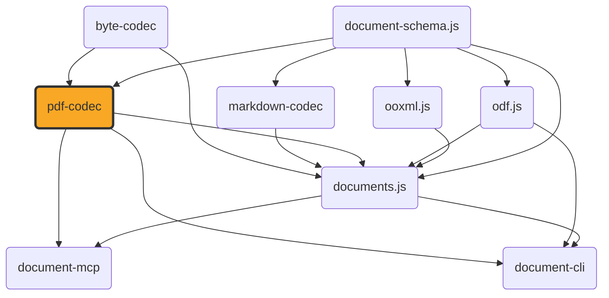

# pdf-codec

[](https://github.com/ExaDev/pdf-codec) [](https://www.npmjs.com/package/pdf-codec) [](https://github.com/ExaDev/pdf-codec/releases/latest) [](https://github.com/ExaDev/pdf-codec/actions)

> A hand-written, dependency-minimal PDF codec: parses arbitrary real-world PDFs into a structured, positioned-content document and generates new PDFs from one, built on its own codec-owned `LayoutDocument` item model and [Zod 4](https://zod.dev) codecs.

`pdf-codec` is the PDF-reading-and-writing half of [`documents.js`](https://github.com/ExaDev/documents.js), extracted into its own package: every layer of the PDF format — the object model, the cross-reference table, the content-stream operators, standard-font metrics, the parser's cross-reference/object-stream resolution and content-stream interpreter — is hand-written against the ISO 32000-1 specification, with no external PDF library (`pdf-lib`, `pdfjs-dist`, `mupdf`, or any other) as a dependency. The one exception is [`fflate`](https://github.com/101arrowz/fflate) for raw DEFLATE/zlib compression. The OpenType/CFF font parsing this package's own writer uses to embed a real math font (`sfnt.ts`/`math-*.ts`) is hand-written too, as are the cryptographic primitives its reader needs to open an encrypted PDF (`crypto/` — MD5, SHA-2, RC4, AES), because `node:crypto` would end this package's platform neutrality and WebCrypto offers neither MD5 nor RC4 nor a synchronous API. The one bundled binary asset is the vendored STIX Two Math font itself (OFL-1.1, see [Fidelity](#fidelity) and `assets/fonts/NOTICE.md`).

This is a genuinely large undertaking with an honest trade-off spelled out in [Fidelity](#fidelity): this is not, and does not attempt to be, as robust against adversarial or badly malformed real-world PDFs as a library with 15+ years of hardening. What it buys instead is a dependency-free, fully auditable PDF implementation with no supply-chain surface beyond `document-schema.js`, `fflate`, and `zod`.

`documents.js` uses this package to convert docx/pptx/odt/odp/ods/odg to and from PDF, and to render MathML formulas (typeset by its own `src/mathml/` engine) through the embedded math font this package parses and writes. That MathML *layout* engine deliberately stays in `documents.js` — see [Architecture](#architecture) for exactly where the boundary sits and why a real `MathBox` value crosses it with zero cast or wrapper.



## Getting started

Requires Node.js `>=20` and pnpm `11.6.0` (pinned via `packageManager` in `package.json`).

```sh
pnpm install
```

Install as a dependency in another project:

```sh
pnpm add pdf-codec
# or
npm install pdf-codec
```

## Usage

Reading and writing PDF bytes:

```ts
import { readPdf, writePdf } from 'pdf-codec';

const layout = readPdf(pdfBytes); // -> LayoutDocument: pages of positioned text/image/rect/line/ellipse/path/link items
const bytes = writePdf(layout);
```

`LayoutDocument` and its whole item family — every item/page/image-asset type and schema, plus `LAYOUT_FORMAT_VERSION` — are this package's own exports, ported from `document-schema.js` (which dropped them) so a codec's native model lives in the codec, the same family pattern as `ooxml.js`'s `Package`/`XmlElement` and `markdown-codec`'s AST. `readPdf`/`writePdf` keep their signatures; callers see the same names from a new home. `documents.js` re-exports the family onward from its own barrel — those re-exports now source from `pdf-codec` rather than `document-schema.js`, same names, new source.

There is deliberately **no `DocumentPackage`-returning read or `DocumentPackage`-accepting write here**, and `readPdf`/`writePdf` are this package's primary API precisely because of that. Every other codec in the family reads its format into `document-schema.js`'s flat `ContentDocument`, so each can offer a tree-native entry point on top of its own flat one — `decompose`/`assemblePackage` outward, `flattenPackage` back. PDF is the mirror image: it yields *layout* cheaply on read, because positioned glyphs and paths are all the format actually states, and semantic content only through a separate, expensive, lossy reconstruction pass that infers paragraphs, headings, tables, and shapes back out of geometry. That inference is semantic policy rather than codec business, so it lives in `documents.js` — a caller wanting a PDF as a `DocumentPackage` goes through `convertDocument` there and reads the tree off its `onDocument` callback or `ConversionResult.package`. The write direction is asymmetric for the same reason: turning a `DocumentPackage` into PDF bytes needs a full layout engine (font measurement, line breaking, page filling), which is also `documents.js`'s, and `writePdf` takes the already-positioned `LayoutDocument` that engine produces. Keeping both edges out of this package is what makes the item layer an honest record of what a file says, separate from what any consumer thinks it means.

An encrypted PDF that opens without a password decrypts transparently — no extra option, no password parameter; one that genuinely needs a user password throws `PdfPasswordRequiredError`. See [Gotchas](#gotchas-and-quirks) for exactly which encryption is supported.

Both accept an optional `signal` (`AbortSignal`); `readPdf` additionally takes a `sink` (`PdfDiagnosticSink`, called once per recoverable parse diagnostic — see the three-tier failure policy under [Conventions](#conventions)), and `writePdf` an `onSubstitution` callback (called once per character not representable in a standard-14 font — see [Fidelity](#fidelity)).

The same round trip is also available as a schema-validated [`z.codec()`](https://zod.dev) pair:

```ts
import { z } from 'zod';
import { pdfCodec } from 'pdf-codec';

const layout = z.decode(pdfCodec, pdfBytes); // throws a ZodError if pdfBytes has no %PDF- header
const pdfBytes2 = z.encode(pdfCodec, layout);
```

This is the no-extra-options form only — `readPdf`/`writePdf` remain the entry points for cancellation, diagnostics, or substitution reporting, none of which fit `z.codec()`'s fixed `decode(input)`/`encode(output)` signature.

Embedding a real math formula: `writePdf`'s own `formulas` option takes an array of `PositionedFormula` — an already-laid-out `MathBox` (positioned glyph runs, fraction/radical rules, radical hook strokes) placed at a page position. This package supplies the font — `loadMathFont()` parses and caches the vendored STIX Two Math font once per process — but it does not lay MathML out itself; that is a separate concern this package deliberately doesn't own (see [Architecture](#architecture)).

```ts
import { loadMathFont, writePdf } from 'pdf-codec';
import { layoutFormula } from 'documents.js'; // or any other producer of a structurally-compatible MathBox

const { metricsAt } = loadMathFont();
const { box } = layoutFormula(mathml, { metrics: metricsAt(12), sizePt: 12, color: { r: 0, g: 0, b: 0 } });

const pdfBytes = writePdf(doc, { formulas: [{ pageIndex: 0, xPt: 50, yPt: 700, box }] });
```

Because `MathBox` and its own constituent types (`MathGlyphRun`/`MathRule`/`MathStroke`/`MathAssembledGlyphs`/`MathColor`) are plain, structurally-typed data — not a class, not branded — any producer whose output matches the shape works here with no cast, no wrapper, and no transformation.

Sizing a stretchy glyph — a parenthesis tall enough to wrap a big fraction, a radical sign sized to its radicand, an over-brace as wide as the content under it — is the OpenType `MATH` table's `MathVariants` job, and `loadMathFont()` exposes it directly:

```ts
import { loadMathFont } from 'pdf-codec';

const { stretchGlyph } = loadMathFont();
const paren = stretchGlyph(0x28, 'vertical', 40, 12); // a '(' stretched to 40pt, set at 12pt
// paren.kind      -> 'assembly' (no single pre-built variant reaches 40pt)
// paren.size      -> the extent actually achieved, >= 40 whenever the font can reach it
// paren.placements -> [{ glyphId, offset, advance }, ...], bottom to top, seams already overlapped
```

Three outcomes: `'base'` (unstretched glyph already big enough), `'variant'` (a pre-built larger glyph selected, always preferred over assembly), `'assembly'` (built by repeating the font's extender piece between end pieces, overlapping each seam by as much as both sides' connector lengths allow). For design-unit callers, `MathFont.stretchyConstruction(codePoint, axis)` returns the raw `MathVariants` data and `assembleStretchyGlyph` performs the same computation over it.

A stretched construction is drawn through `MathBox`'s own `MathAssembledGlyphs` item kind: `{ glyphId, xPt, yPt }` placements addressed by **glyph ID**, not Unicode text — most glyphs a `MathVariants` construction names have no code point at all. The composite font this package embeds is Identity-H with CID == GID, so a bare glyph ID is directly showable. An unencoded glyph gets no ToUnicode entry, so `MathAssembledGlyphs` also carries the operator's original `text`, emitted as an `/ActualText` marked-content span so a tall assembled bracket still extracts as `(`.

`MathFontMetrics.stretch` is the layout-facing form: it resolves a construction at a target size and additionally **measures** it — `inkAscentPt`/`inkDescentPt` are the whole construction's real ink extent about its drawing origin, taken from actual glyph outlines.

Building a layout engine on top of this codec (this is what `documents.js`'s own `src/layout/` does): `TextMeasurer`/`createStandardFontMeasurer` answer "how wide does this text render, and where does this line break" against standard-14 metrics; `resolveStandardFont`/`STANDARD_METRICS` map an arbitrary family/weight/style onto one of the 14 standard PDF faces. The text-wrapping primitive (`wrapRunsToWidth`) and shape-rotation geometry (`rotatePointAboutCenter`) live in documents.js (they had no internal pdf-codec caller); the port types they consume (`TextMeasurer`, `StyledRun`, `WrappedLine`, `ProvidedFont`, the `MathBox`/`MathFontMetrics` family) live in `document-schema.js`, the neutral shared-schema package, while the `LayoutDocument` they build is this package's own type.

Embedding real fonts instead of substituting standard-14 faces, via a `FontRegistry` (see `src/font-registry.ts` for the source-document → caller-supplied → vendored-substitute → standard-14 resolution order). Pass the same registry to both the measurer and `writePdf` so what was measured and what gets drawn come from one font:

```ts
import { createFontMeasurer, createFontRegistry, writePdf } from 'pdf-codec';

// With no `fonts`/`sourceFonts` of its own, the registry still maps Calibri onto the vendored,
// metric-compatible Carlito face this package embeds (and Cambria onto Caladea).
const fonts = createFontRegistry();

const measurer = createFontMeasurer(fonts);
// ... wrap text + build a LayoutDocument using the measurer (documents.js owns wrapRunsToWidth) ...
const pdfBytes = writePdf(doc, { fonts, onMissingGlyph: (m) => console.warn('no glyph for', m.from) });
```

Every text run whose family resolves to a real face is subsetted to the glyphs the document actually uses and embedded as its own `/Type0` + `/CIDFontType2` + `/FontFile2` group. **Omit `fonts` and nothing changes at all** — output is byte-identical to a build with no embedded-font support (asserted against golden digests in `src/write-embedded-font.test.ts`).

Inspecting a standalone font file before handing it to a `FontRegistry` as a `ProvidedFont`: `readFontFace` reads family/bold/italic straight off the font's own `name`/`OS/2`/`head` tables — exactly the triple `ProvidedFont` needs:

```ts
import { createFontRegistry, readFontFace } from 'pdf-codec';

const { family, bold, italic } = readFontFace(brandSansTtfBytes, 'BrandSans-Bold.ttf'); // throws FontFaceParseError, naming the source, for a .ttc/.woff file or one with no family name
const fonts = createFontRegistry({ fonts: [{ family, bold, italic, bytes: brandSansTtfBytes }] });
```

`createFontMeasurer`'s second argument carries `verticalMetrics`, a `VerticalMetricPolicy` of `'hhea'` (default) / `'os2Typo'` / `'os2Win'`, deciding which of the three competing ascent/descent/line-gap sets an sfnt declares should drive line height for an embedded face.

Reading a JPEG 2000 image directly, either as pixels or as metadata alone:

```ts
import { decodeJpeg2000, readJpeg2000Metadata } from 'pdf-codec';

// Works on any conforming codestream -- including one whose pixels this decoder refuses, which is what `decodable`/`undecodableReason` are for.
const metadata = readJpeg2000Metadata(jp2OrCodestreamBytes);
console.log(metadata.width, metadata.height, metadata.transform, metadata.layers, metadata.decodable, metadata.undecodableReason);

const image = decodeJpeg2000(jp2OrCodestreamBytes); // -> { width, height, bitDepth, components: Int32Array[] }, one plane per component
```

Both accept a whole JP2 file or a bare codestream; `decodeJpeg2000` takes an optional `onWarning` for recoverable cases and throws `Jpeg2000UnsupportedError` for anything outside [JPEG 2000 scope](#jpeg-2000-scope). Inside a PDF none of this needs calling: `readPdf` decodes a `/JPXDecode` image XObject through the same path automatically.

The generic byte- and image-container primitives (`crc32`, `deflate`/`inflate`/`inflateTolerant`, `ByteReader`/`ByteWriter`/`concatBytes`, `readJpegInfo`, `decodePng`/`encodePng`, `unfilterScanlines`/`filterScanlines`) are re-exported from [byte-codec](https://github.com/ExaDev/byte-codec). The PDF-specific image codecs (`decodeCcittFax`, `decodeJbig2Embedded`, `decodeJpeg2000`/`readJpeg2000Metadata`/`parseJp2Container`) stay here.

Every module under `src/` is also deep-importable directly by its own subpath:

```ts
import { crc32 } from 'pdf-codec/bytes/crc32';
import { readJpegInfo } from 'pdf-codec/image/jpeg-info';
```

This works via package.json's `"./*"` wildcard export, resolving any `pdf-codec/<path>` subpath to the correspondingly-named file under `dist/` — both ESM `import` and CJS `require` resolve the same way.

## Architecture

The package is layered from generic primitives outward to the codec itself:

- **`src/layout.ts`** — this package's own native document model: the `LayoutDocument` item family — Zod schemas and inferred types for text/image/rect/line/ellipse/path/link items, pages (with the hidden speaker-notes channel), the image-asset registry, and `LAYOUT_FORMAT_VERSION`. Ported verbatim from `document-schema.js`, which carried it until its 4.0.0 dropped it — a codec's native model lives in the codec, like `ooxml.js`'s `Package`/`XmlElement` and `markdown-codec`'s AST; only PDF's native model was ever a public shared-schema export, an accident of this package predating the content pivot. The item layer remains the honest boundary between what the format says (positions) and what we think it means (structure): when reconstruction misjudges a wrapped paragraph, the items stay inspectable as the PDF's actual testimony. The shared leaf shapes the family composes from (`Color`, `ContentStrokeStyleSchema`, `LayoutFont`, `LayoutMetadata`) stay in `document-schema.js` and are imported, keeping one definition of each across content and layout.
- **The math port types** — `MathColor`/`MathGlyphRun`/`MathRule`/`MathStroke`/`MathLayoutItem`/`MathBox`/`MathGlyphMetrics`/`MathFontMetrics` and `PositionedFormula`, sourced from `document-schema.js`'s math layout port (one shared definition across the family, not a local mirror). Deliberately not imported from `documents.js` — that would be a circular dependency once `documents.js` depends on this package. Because every one of these types is plain data (only `MathFontMetrics` carries a method), a real `MathBox` value `documents.js` produces passes into `writePdf({ formulas })` with zero cast, zero wrapper, and zero transformation.
- **`src/bytes/`** and **`src/image/`** — generic byte and image-container primitives with zero PDF-specific knowledge: a chunked byte writer, backtracking byte reader, CRC32, a hand-written PNG decoder/encoder, JPEG marker scanning for dimensions only (compressed bytes pass through unchanged), a hand-written CCITT Group 3/Group 4 fax decoder (ITU-T T.4/T.6), a hand-written JBIG2 decoder (ITU-T T.88 — `jbig2-arith.ts` MQ decoder, `jbig2-bitmap.ts`, `jbig2-generic.ts`, `jbig2-text.ts`, `jbig2.ts`), and a hand-written JPEG 2000 decoder (ISO/IEC 15444-1 — `jp2-boxes.ts`, `jpeg2000-codestream.ts`, `jpeg2000-tagtree.ts`, `jpeg2000-t2.ts`, `jpeg2000-t1.ts`, `jpeg2000-dwt.ts`, `jpeg2000.ts`). `src/filters.ts` owns all PDF knowledge for CCITT/JBIG2 (resolving parameters, `/JBIG2Globals`, inverting polarity); `src/images-read.ts` owns the JPEG 2000 PDF integration. `src/bytes/flate.ts` is the only file that imports `fflate`.
- **`src/util/`** — two small independently-duplicated copies of family-shared logic: `base64.ts` (verbatim copy of `odf.js`'s own, replacing a former `ooxml.js` dependency for this one helper) and `abort.ts` (`throwIfAborted`, called at every page loop boundary — there is no `await` point in this synchronous pipeline for cancellation to hook into implicitly).
- **`src/crypto/`** — MD5, SHA-256/384/512, RC4, and AES-CBC, hand-written with zero local imports. Not a preference: ISO 32000-1's key-derivation algorithms name MD5 and RC4 directly, neither offered by any portable platform crypto API, and `crypto.subtle` is asynchronous where this codec's read path is synchronous end to end. Reaching for `node:crypto` would break the browser bundle. Each module cites its specification (RFC 1321, FIPS 180-4, FIPS 197) and is tested against published conformance vectors.
- **The codec itself, importing only `layout`/`bytes`/`image`/`crypto`/`util` plus `document-schema.js`'s port types (no OOXML or ODF knowledge):**
  - **Write**: `objects.ts` (the `PdfObject` discriminated union), `afm-widths.ts`/`encoding.ts`/`winansi.ts`/`fonts.ts` (standard-14 metrics, WinAnsi encoding, family resolution), `font-registry.ts` (resolution port plus `resolveFaceWithRegistry`, the one step both measurer and writer resolve through so they can never disagree about which face a `LayoutFont` means), `font-face.ts` (`readFontFace`, reading a standalone font file's family/bold/italic triple off its `name`/`OS/2`/`head` tables), `measure.ts`/`text-layout.ts` (greedy line-wrapping against either standard-14 AFM widths plus per-family correction or a resolved face's own real `hmtx` advances — never both), `content-write.ts` (`LayoutItem[]` → content-stream operators, with text branching on standard-14 vs embedded face encoding, pair-kerning split into `TJ` arrays, and stroke `style` becoming real dash/line-cap state), `write.ts` (the full object graph, cross-reference table, trailer, and embedded font groups).
  - **sfnt font tables**: `sfnt.ts` (bounds-checked table-directory reader), `cmap-table.ts` (Unicode → glyph ID, formats 4/12/6), `hmtx-table.ts` (per-glyph advance widths), `font-tables.ts` (`head`/`maxp`/`OS/2`/`post`/`name`), `glyf.ts` (`loca` offset index, per-glyph headers, composite component records, `glyphInkBounds`), `math-table.ts` (OpenType `MATH` constants/glyph-info/variants subtables). `ot-layout-common.ts` (Coverage/ClassDef, stored as sorted glyph ranges searched by bisection). `gpos-table.ts` reads `GPOS` for exactly one thing: pair-advance kerning through the `kern` feature, both PairPos formats and LookupType 9 Extension indirection — mark attachment, cursive joining, and contextual positioning have no consumer here. Every parser degrades to `undefined` on a missing/truncated table rather than throwing.
  - **sfnt subsetting**: `sfnt-subset.ts` — a TrueType-outline glyph subsetter (Unicode code points → glyph IDs via `cmap`, transitive closure over `glyf` composite components, rebuilt sfnt carrying only used outlines). **Glyph IDs are preserved, never renumbered**, keeping composite component references valid and making CID == GID trivially true. Output rebuilds `head`/`hhea`/`maxp`/`loca`/`glyf`/`hmtx`, copies hinting programs verbatim, stubs `post`, omits `cmap`/`name`/`OS/2`/`GSUB`/`GPOS`/`kern` (none read through a `CIDFontType2` program per ISO 32000-1 9.9). Applies to `glyf`-flavoured fonts only; CFF returns `undefined`.
  - **Embedded math font**: `math-font.ts` (parses/caches the vendored STIX Two Math font, exposing size-specific `MathFontMetrics` and stretchy-glyph entry points), `math-stretch.ts` (OpenType MATH two-stage stretching: pick smallest pre-built variant reaching target, else assemble from repeated parts with seams overlapped), `math-font-write.ts` (builds the `/Type0`/`/CIDFontType0`/`/FontDescriptor`/`/FontFile3`/ToUnicode group), `math-content-write.ts` (`PositionedFormula[]` → content-stream bytes, Identity-H CIDs for text, `re`/`m`/`l` operators for rules, glyph-ID-addressed text objects for stretched constructions wrapped in `/ActualText`).
  - **Embedded text faces**: `embedded-font.ts` (parses one TrueType-outline face's metrics and `GPOS` pair kerning, and `encodeForShowEmbedded` — the single code path both measurement and text-showing go through so encoding and measuring cannot disagree). Every geometry field is converted into PDF's 1000-units-per-em glyph space. `embedded-font-write.ts` builds the `/Type0`/`/CIDFontType2`/`/FontDescriptor`/`/FontFile2`/ToUnicode group, with `/CIDToGIDMap /Identity` written explicitly and `/Length1` set to the **uncompressed** subset length. Its subset tag is a CRC32 over the face's PostScript name and glyph-ID list, so identical input yields byte-identical output.
  - **ToUnicode CMaps**: `tounicode.ts`, shared by both embedded-font writers — a character code → Unicode code point mapping written as a bfchar CMap (9.10.3), with supplementary-plane code points encoded as UTF-16BE surrogate pairs and entries emitted in blocks of at most 100.
  - **CFF reading**: `cff.ts` (shared `INDEX`/`DICT` container structures), `cff-bounds.ts` (a Type 2 charstring interpreter computing each glyph's tight ink bounding box by tracking the current point through every path operator and solving each cubic's real extrema from the roots of its derivative — a path walker, not a rasteriser; verified against the vendored STIX Two Math font's whole 5,543-glyph repertoire, matching fontTools' `BoundsPen` to within 0.01 design units). `cff-probe.ts` reads a bare CFF program's header/Name INDEX/Top DICT to detect the `ROS` operator defining a CID-keyed font — the guard a future source-embedded-font phase needs before it can trust CID == GID against an arbitrary caller-supplied font.
  - **Read**: `lexer.ts`/`parse.ts` (byte tokenizer and tokens → `PdfObject`), `filters.ts`/`predictors.ts` (Flate/LZW/ASCII85/ASCIIHex/RunLength/CCITTFax, TIFF/PNG predictors), `xref.ts`/`document.ts` (classic and cross-reference-stream resolution, object streams, `/Prev` chains, linear-scan recovery, the page tree with attribute inheritance), `encrypt.ts` (standard security handler: `/Encrypt` parsing, empty-user-password key derivation and `/U` verification, per-object keys, transparent string/stream decryption), `content-read.ts`/`interpret.ts` (content-stream tokenizer and graphics/text state machine, form-XObject recursion, general vector-path tracking), `cmap.ts`/`font-style.ts`/`font-read.ts` (`/ToUnicode` CMaps, font-dictionary resolution), `images-read.ts` (Image XObjects → PNG/JPEG bytes), `read.ts` (`readPdf`, assembling all of the above into a `LayoutDocument`).
  - `codec.ts` — `pdfCodec`, a `z.codec()` pair over `readPdf`/`writePdf`, plus a standalone local copy of the `%PDF-` header check.
- **`src/test-support/`** — hand-built PDF fixtures (`pdf.ts`) built by literal byte/string concatenation and deliberately importing NOTHING from this package's own writer (a fixture built by `writePdf` would let a writer bug hide from the corresponding reader test). `encrypted-pdfs.ts` applies the same principle: real PDFs encrypted by [qpdf](https://qpdf.sourceforge.io/), embedded as base64, so a bug in key derivation cannot cancel out between write and read halves. `fonts.ts` holds the real vendored Carlito and Caladea faces as raw sfnt bytes, and asserts values read out of the `.ttf` files by a standalone script with a bare `DataView`, not by this package's own parsers — external cross-checks rather than a parser's output compared against itself.

Dependency direction is strictly downward and checkable: `layout` imports only `zod` and `document-schema.js`'s shared leaf schemas; `bytes`/`crypto`/`util` import nothing local (`bytes/flate.ts` imports `fflate`); `image` imports `bytes` only; the codec itself imports `layout`+`bytes`+`image`+`crypto`+`util` plus `document-schema.js`'s port and leaf types, and nothing else from outside. Nothing anywhere under `src/` imports a `node:` builtin, which is what lets `tsdown`'s `platform: 'neutral'` build run unchanged in a browser bundle. No `PdfObject`/`PdfDict`/`PdfStream` type appears outside the codec's own read/write modules.

## Conventions

- **Zod-first schema/type/guard**: `PdfBytesSchema` (in `codec.ts`) and `LayoutDocumentSchema` (in `src/layout.ts`, this package's own native model) are the only two schemas this package validates against; every other model type (`PdfObject`, `MathBox` and friends) is plain TypeScript, never Zod-validated.
- **`z.codec()` for the one schema-to-schema round trip**: `pdfCodec` (PDF bytes ⇄ `LayoutDocument`), wrapping the already-independently-tested `readPdf`/`writePdf` pair and adding automatic two-way schema validation. Deliberately the no-options form — `readPdf`/`writePdf` remain the primary entry points wherever a caller needs an `AbortSignal`, a `PdfDiagnosticSink`, or an `onSubstitution` callback.
- **`PdfObject` has no Zod schema at all**, deliberately: it never crosses a public boundary or round-trips through JSON, and is constructed exclusively by this package's own parser. It narrows natively on its own `kind` discriminant.
- **The `MathBox`/`MathFontMetrics` family is structurally typed on purpose, not validated by Zod** — the mechanism that lets a caller (`documents.js`) hand this package a real value produced by a completely independent module, with zero cast, zero wrapper, and no shared class or branded type.
- **No type assertions anywhere.** Every third-party or loosely-typed value is narrowed through a type guard or a Zod parse at the boundary.
- **A three-tier PDF-read failure policy**: throw a typed `PdfParseError`/`PdfEncryptedError`/`PdfPasswordRequiredError` for a file that cannot be meaningfully processed at all; recover with a `PdfDiagnostic` (`severity: 'warning'`) for something malformed but salvageable; degrade with a diagnostic for an individual unsupported feature while the rest of the document still reads.
- **Conventional commits**, enforced via commitlint + husky.

## Gotchas and quirks

- **Reading arbitrary real-world PDFs is the single largest risk surface in this package**, and the parser targets cleanly-generated output from mainstream producers (Word, PowerPoint, Chrome, LibreOffice, Acrobat), recovering from the malformations those producers actually create, and failing loudly and specifically on anything else — not matching a mature library's robustness against adversarial input.
- **An encrypted PDF is readable when, and only when, it opens without a password** — the overwhelmingly common real-world case (a permissions-only file whose owner password may be set but whose user password is empty). Supported: `/Filter /Standard` at `/V` 1, 2, 4, and 5 — RC4-40, RC4-128, AES-128, AES-256 — including `/EncryptMetadata false` and `/Identity` crypt filters. A file genuinely needing a user password throws `PdfPasswordRequiredError` (distinct from `PdfEncryptedError`, because "supply the password" and "this codec cannot read this at all" are different things to tell a user).
- **Nothing in this codec accepts, prompts for, or guesses a password.** Authenticating as owner is a permissions escalation, not a way to read a file you were already allowed to read.
- **`CCITTFaxDecode`, `JBIG2Decode` and `JPXDecode` images all decode for real** via hand-written decoders (`src/image/ccitt.ts` for ITU-T T.4/T.6 fax; `src/image/jbig2*.ts` for ITU-T T.88; `src/image/jpeg2000*.ts` for ISO/IEC 15444-1). JPEG images (`DCTDecode`) pass through losslessly in both directions. See [JBIG2 scope](#jbig2-scope) and [JPEG 2000 scope](#jpeg-2000-scope) for exactly what is and is not implemented.
- **`interpret.ts` tracks general vector paths, not just axis-aligned `re` rectangles.** `m`/`l`/`c`/`v`/`y`/`h` (and `re` itself) accumulate real subpaths — CTM-transformed line/cubic segments, open or closed — and any paint operator emits an item built from them. A recovered path matching one of three characteristic shape patterns comes back as that shape's own kind, not a generic `LayoutPath`: an axis-aligned closed four-corner subpath is a `LayoutRect`; a closed subpath of four cubic segments meeting its bounding box at cardinal points with kappa-ratio control points is a `LayoutEllipse`; an open single-straight-segment stroke-only subpath is a `LayoutLine` (tolerance: `max(1e-3pt, 1e-4 × extent)`). **These are deliberate, bounded heuristics** — a false positive changes an item's kind, never its geometry, since every detected shape reproduces its source path's own points exactly. Off-axis rotations, non-quadrant curves, polygons, and multi-subpath figures stay a `LayoutPath`.
- **`writePdf`/`readPdf` round-trip a page's own `notes` field via a hidden `/Subtype /Text` annotation** with the `Hidden` flag set so it never renders or prints, distinguished from a genuine third-party sticky note by an internal author marker. This is a round-trip mechanism specific to this package's own writer/reader pair. `documents.js` uses this to carry pptx/odp speaker notes through PDF.
- **STIX Two Math is a CFF-flavoured OpenType font, not TrueType/glyf** — the **entire** `CFF ` table is embedded verbatim as a single `/FontFile3` `/Subtype /CIDFontType0C` stream (a real, correct, working embedded font, just not glyph-subsetted). Everything else genuinely IS built from a targeted parse of only what's used: `cmap` resolves exactly the Unicode code points a document's formulas reference, and the emitted `/W` widths array covers only drawn glyph IDs. A CID-keyed composite font built this way needs no `/CIDToGIDMap` — per ISO 32000-1 9.7.4.2, a `/CIDFontType0` whose `/FontFile3` is a non-CID-keyed CFF program is read with CID directly indexing `CharStrings` by glyph order (CID == GID).
- **The OpenType `MATH` table's `MathVariants` is parsed, stretchy-glyph assembly implemented, and the result genuinely drawable** via `MathAssembledGlyphs` (glyph-ID-addressed placements, since most construction glyphs have no Unicode code point — they draw directly because CID == GID here). An unencoded glyph gets no ToUnicode entry; the construction is wrapped in an `/ActualText` span carrying the operator's own text so it still extracts as `(`. `MathConstants` and `MathGlyphInfo` (italics correction, top-accent attachment) are parsed in full.
- **What this package draws for a stretchy glyph is decided entirely by its caller.** Which operators a document actually stretches is a layout-engine decision — `documents.js`'s own `src/mathml/layout.ts` currently stretches vertical fences in an `mrow` and nothing else.
- **Real per-glyph ink bounds are measured from the outline (`inkAscentPt`/`inkDescentPt`), computed by walking each glyph's Type 2 charstring.** `ascentPerEm`/`descentPerEm` remain alongside them as the uniform face-wide figure, still the right measure for anything sized against the font rather than particular characters, and the fallback for a glyph with no outline to measure. An ink box is genuinely tight, which for a math font is often *larger* than the nominal metrics (over a tenth of STIX Two Math's repertoire draws above its nominal ascent). `inkDescentPt` is negative where the glyph's lowest ink sits above the baseline.
- **A `LayoutLine`/`LayoutPath` `style` of `dashed`/`dotted` becomes a real dash-array (`d`) operator scaled to the stroke's own width; `double` becomes two genuinely separate offset strokes.** Dash lengths are stroke-width multiples so a hairline and a thick rule both read as recognisably dashed: `dashed` emits `[3w 3w] 0 d`, `dotted` emits `[0 2w] 0 d` with a `1 J` round cap (the zero on-length under a round cap paints a filled circle — exactly a dot; under PDF's default butt cap it paints nothing). Both are reset immediately after the paint operator (`[] 0 d`, `0 J`) since the graphics state persists for the whole content stream. `double` has no PDF operator and is drawn as geometry: width `w` splits into three equal bands, each rule `w/3` wide with centreline `w/3` offset, outer edges matching the single stroke's. Nothing on the read side recovers a stroke style — a dashed line read back comes back solid.
- **An embedded `CIDFontType2` program needs no `cmap` table of its own**, and `sfnt-subset.ts`'s output doesn't carry one — character code → CID goes through the `Type0` font's `/Encoding` (Identity-H, so CID == character code), and CID → GID through `/CIDToGIDMap /Identity` (matching the GID-preserving design). Both happen inside the PDF's object graph, before the embedded font program is consulted (ISO 32000-1 9.7.4.2).
- **`GPOS` pair kerning is read and applied for an embedded face; no other OpenType layout feature is.** `GSUB` (ligatures, contextual alternates, small caps) is never applied — a face's `fi` ligature is drawn as two separate glyphs. The legacy `kern` table is not read either (neither Carlito nor Caladea ships one). A kerned run is shown with `TJ`, and the sign of a `TJ` number is the opposite of the adjustment it expresses (ISO 32000-1 9.4.3: a positive number moves the next glyph closer). A run with no kerning pairs stays as one unsplit hex string with `Tj`.
- **Kerning applies to whole shown strings, so a wrap decision does not see a pair straddling the boundary between two separately-measured words.** The width a line reports is the width the page draws; making the wrap decision itself exact would mean widening the `TextMeasurer` port for a sub-point difference that only ever errs towards breaking a line early.
- **`font-substitutes.ts` maps both `Calibri` and `Calibri Light` onto the same ordinary-weight Carlito face** — Carlito ships only one weight per style axis, so `Calibri Light` substitutes to standard Carlito rather than a genuinely lighter face. An honest, documented approximation: width metrics match, visibly thinner strokes do not.
- **`cff-probe.ts`'s CID-keyed CFF guard exists for a source-embedded-font phase this package hasn't built yet** — it is not wired into any write path today. Every face currently embedded is `glyf`-flavoured TrueType, and `sfnt-subset.ts` already refuses anything else before this guard would run.

## JBIG2 scope

`src/image/jbig2*.ts` is a hand-written ITU-T T.88 decoder covering what real scanned PDFs actually contain.

**Implemented.** The MQ arithmetic decoder (Annex E) and arithmetic integer/symbol-ID procedures (Annex A). Generic region decoding (6.2) for all four templates with adaptive pixels, typical prediction (TPGDON), and the MMR variant (routing through `src/image/ccitt.ts`). Generic refinement region decoding (6.3) for both templates. Symbol dictionaries (6.5) and text regions (6.4) in arithmetic form, covering height classes, export-flag runs, every reference corner, transposed regions, multi-row strips, and refined symbol instances. Segment framing (clause 7) including long referred-to-segment form, page composition with all five combination operators, and `/JBIG2Globals` streams.

**Not implemented, each raising `Jbig2UnsupportedError` by name:** Huffman-coded forms (`SDHUFF`/`SBHUFF`), halftone regions and pattern dictionaries, intermediate regions, segments of unknown length, `EXTTEMPLATE`, imported arithmetic coding contexts, typical prediction in a refinement region (`TPGRON`), and aggregate refinement/aggregate symbol coding. `src/filters.ts` turns each into a `pdf/jbig2-undecodable` diagnostic, leaving the image's bytes undecoded while the rest of the page still reads.

**Verification.** `src/test-support/jbig2.ts` holds real streams from three independent producers: jbig2enc (the encoder behind essentially every JBIG2-in-PDF in the wild), libtiff (MMR payloads), and a hand-written T.88 Annex E arithmetic encoder for templates jbig2enc will not emit. Every stream — hand-encoded ones included — is decoded by jbig2dec (Ghostscript's independent implementation) before being written out, and the bitmap recorded as each fixture's expected output is jbig2dec's, not this package's. The symbol-mode fixtures exist in six variants with only `REFCORNER`/`TRANSPOSED` bits rewritten, turning jbig2dec's output into a real differential test of the placement rules jbig2enc never exercises.

A differential test pins the *set* of template positions and offsets but not their *order* — a context index is only a label for a neighbourhood pattern, so any consistent permutation cancels between encoder and decoder. TPGRON is refused rather than shipped unverified: jbig2enc's refinement support is disabled upstream, so the only available stream is one this package encoded itself, which cannot pin the pseudo-context constant even in principle (brute-forcing all 1024 candidates confirmed different unrelated bands of constants pass depending on the test image).

## JPEG 2000 scope

`src/image/jp2-boxes.ts` and `src/image/jpeg2000*.ts` are a hand-written ISO/IEC 15444-1 (ITU-T T.800) decoder. The MQ arithmetic decoder is reused from `jbig2-arith.ts` (T.800 Annex C and T.88 Annex E specify one identical coder), with JPEG 2000's own three non-zero initial context states applied on top.

**Implemented.** The JP2 file format (Annex I) and bare codestreams (which a PDF `/JPXDecode` stream may carry — ISO 32000-1 7.4.9). The codestream syntax (Annex A): SIZ, COD, COC, QCD, QCC, POC, RGN, COM, SOT, SOD with tile-part overrides. Tier-2 packet decoding (Annex B): stuffed-bit packet headers, tag trees, code-block inclusion, precinct partitions at any size, SOP/EPH markers. Tier-1 EBCOT (Annex D): three coding passes, zero-coding context tables for all four subband orientations, sign coding, magnitude refinement, cleanup with run-length, and vertically-causal/reset/segmentation-symbol code-block styles. Both wavelets (Annex F): reversible 5-3 integer and irreversible 9-7 floating-point. Dequantization (Annex E), both component transforms and DC level shift (Annex G). LRCP and RLCP progression generally; RPCL, PCRL, CPRL when every resolution holds a single precinct.

**Not implemented, each raising `Jpeg2000UnsupportedError` by name:** sub-sampled components, regions of interest (RGN), progression-order changes (POC), packed packet headers (PPM/PPT), selective arithmetic coding bypass and terminate-on-every-pass code-block styles, JP2 palette boxes, and mixed component bit depths/signedness. `src/images-read.ts` turns each into an `image/jpx-undecodable` diagnostic and skips the image.

**Verification.** `src/test-support/jpeg2000.ts` holds real codestreams from OpenJPEG's own `opj_compress`. For every reversible fixture the generator first proves byte-identical round-trip through `opj_decompress`, then records **the source image** as the expected output — the original integers the encoder was handed, which no shared encoder/decoder mistake can fake. The irreversible 9-7 wavelet is lossy by construction, so expected samples are `opj_decompress`'s output; the test asserts every sample within one, with under 1% differing (in practice a handful by exactly one — floating-point rounding at a round-to-nearest boundary, where OpenJPEG carries a slightly truncated normalisation constant).

## Fidelity

**Ordinary text uses the standard 14 fonts only, unless a caller supplies `WritePdfOptions.fonts`.** Without a registry, Helvetica/Times-Roman are metric-compatible substitutes for Arial/Times New Roman, but Calibri/Cambria/Aptos are not — `measure.ts` narrows the gap with a per-family width-correction table (Calibri 8% narrower, Verdana 9% wider) and `content-write.ts` draws at the matching `Tz` scale so measurement and drawing agree, but it remains a stretched standard-14 face rather than the real one.

**Supply a `FontRegistry` and Calibri/Cambria stop being an approximation at all** — the vendored Carlito/Caladea faces are the real metric-compatible TrueType families, resolved automatically. Aptos still has no vendored substitute. A resolved face is measured at its own real `hmtx` advances (never the width-correction table — applying both would silently draw text narrower than measured), subsetted to used glyphs, and embedded as a real `/Type0` + `/CIDFontType2` + `/FontFile2` group. Remaining limits: only TrueType (`glyf`) outlines can be embedded; a character with no glyph is drawn as `.notdef` and reported through `onMissingGlyph`; and vertical-metric policy is caller-chosen.

**The acceptance bar for embedded-font fidelity is "no page-count drift on a real corpus", not "line-identical".** An embedded run is placed at real `hmtx` advances adjusted by real `GPOS` pair kerning — measured and drawn from one shared computation. What separates this from line-identical: `GSUB` ligatures/contextual alternates are never applied, and kerning is within each shown string rather than across whitespace boundaries a wrap decision measures separately.

**The one exception is math-formula rendering (`WritePdfOptions.formulas`): this genuinely embeds a real, hand-parsed font.** Real box-model glyph runs through the embedded STIX Two Math font with genuine per-glyph metrics and font-wide layout constants parsed directly from the `MATH` table. Stretchy constructions are real: a `MathVariants` variant or assembly resolved, measured against actual outlines, and drawn by glyph ID.

**`readPdf(writePdf(doc))` is not guaranteed to reproduce `doc` exactly, and `writePdf(readPdf(bytes))` is not guaranteed to reproduce `bytes` exactly.** A PDF page is fundamentally positioned drawing operators, not a structured document — a shape drawn any way other than the recognised characteristic patterns, or rotated off-axis, collapses to a generic `LayoutPath`. This is a deliberate, permanent contrast with format-preserving codecs like `ooxml.js`'s `packageCodec`. `pdfCodec` shares `z.codec()`'s *mechanism* (schema-validated both ways) but not that *guarantee*.

**Optional real-world corpus.** `test/corpus/` (gitignored) holds a `pnpm test:corpus` vitest project for manual conformance checking against real PDFs — Word/PowerPoint/Chrome/LibreOffice exports. Not part of `pnpm test` and does not gate CI; drop files in locally before a significant parser change.

## Release and publishing

`.github/workflows/ci.yml` runs commitlint, lint, typecheck, the unit suite, and the smoke test on every push and pull request. On a push to `main` where those all pass, `release.config.ts` drives [semantic-release](https://semantic-release.gitbook.io/semantic-release): commit history since the last tag decides the version bump, `CHANGELOG.md` and `package.json` are committed back to `main`, a GitHub Release is cut, and the package publishes to [npmjs.org](https://www.npmjs.com/package/pdf-codec) — via npm's OIDC trusted publishing, so no `NPM_TOKEN` exists anywhere in the pipeline.

Whether that release actually published a new version is detected by diffing `package.json`'s version before and after the release step. Two further jobs gate on that: one republishes the same build under the scoped `@exadev/pdf-codec` alias to GitHub Packages (authenticating with `GITHUB_TOKEN`), and one packs the release, generates an SPDX SBOM (`pnpm sbom`), and signs both an SBOM and a build-provenance attestation against that exact tarball — verifiable independently of the registry, and still present if the package is later unpublished.

## Contributing

Commits follow Conventional Commits (`feat:`, `fix:`, `test:`, `chore:`, …), enforced by commitlint (`commitlint.config.ts`) via a husky `commit-msg` hook and a CI `commitlint` job — semantic-release's version bump depends on these being well-formed, not just style. A husky `pre-commit` hook runs `lint-staged` (`eslint --fix` on staged `*.ts` files) and `pre-push` runs the test suite. The package's scripts are turbo-wrapped:

```sh
pnpm build         # tsdown (ESM + CJS + .d.ts)
pnpm typecheck     # tsc -p tsconfig.json + tsconfig.node.json
pnpm lint          # eslint . --fix --cache --max-warnings 0
pnpm test          # vitest run --project unit
pnpm test:workers  # vitest run --config vitest.workers.config.ts
pnpm test:smoke    # tsdown && vitest run --project smoke
pnpm test:corpus   # vitest run --project corpus (manual, gitignored fixtures)
```

There is a single `main` branch and no open pull request workflow established so far.

## References

- [documents.js](https://github.com/ExaDev/documents.js) — the package this codec was extracted from, and its principal downstream consumer: docx/pptx/odt/odp/ods/odg ⇄ PDF conversion, and MathML formula rendering (its own `src/mathml/` typesetting engine feeds a real `MathBox` into this package's `writePdf({ formulas })` with zero cast).
- [document-schema.js](https://github.com/ExaDev/document-schema.js) — the sibling package that owns the canonical `ContentDocument`/`DocumentPackage` pivots the wider family shares, plus the shared leaf shapes and port types this package imports (`Color`, `LayoutFont`, `LayoutMetadata`, `TextMeasurer`, the math family). The `LayoutDocument` item family itself lived there until moving into this package.
- [qpdf](https://qpdf.sourceforge.io/) — the independent implementation that produces this package's encrypted-PDF test fixtures. A build-time and test-time tool only, never a dependency of the package itself.
- The specifications `src/crypto/` implements, each cited in the module that implements it and checked against published conformance vectors: [RFC 1321](https://www.rfc-editor.org/rfc/rfc1321) (MD5), [FIPS 180-4](https://csrc.nist.gov/pubs/fips/180-4/upd1/final) (SHA-256/384/512), [FIPS 197](https://csrc.nist.gov/pubs/fips/197/final) (AES), and [NIST SP 800-38A](https://csrc.nist.gov/pubs/sp/800/38/a/final) (CBC mode). The standard security handler is ISO 32000-1 7.6, extended for revisions 5 and 6 by ISO 32000-2 7.6.4.3.
- [STIX Two Math](https://github.com/stipub/stixfonts) — the embedded math font, vendored at `assets/fonts/STIXTwoMath-Regular.otf` and embedded into `dist/` as a base64 string (`src/assets/stix-two-math-font.ts`, generated by `scripts/generate-math-font-asset.mjs`). Copyright 2001-2021 The STIX Fonts Project Authors, licensed [OFL-1.1](assets/fonts/OFL.txt) — see `assets/fonts/NOTICE.md` for the exact source commit and version.

## npm aliases

This package also publishes under the following alternate npm names — the identical build, same version, republished by CI alongside the primary `pdf-codec` package:

- [pdf-codec.js](https://www.npmjs.com/package/pdf-codec.js)
- [pdf-parser.js](https://www.npmjs.com/package/pdf-parser.js)

## License

MIT
