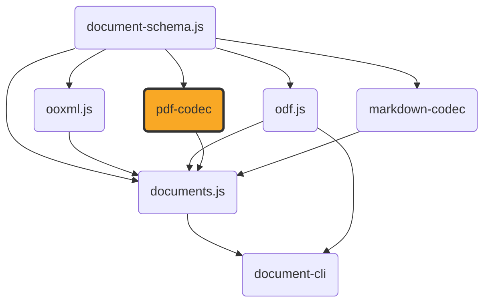

# pdf-codec

[](https://github.com/ExaDev/pdf-codec) [](https://www.npmjs.com/package/pdf-codec) [](https://github.com/ExaDev/pdf-codec/releases/latest) [](https://github.com/ExaDev/pdf-codec/actions)

> A hand-written, dependency-minimal PDF codec: parses arbitrary real-world PDFs into a structured, positioned-content document and generates new PDFs from one, built on [`document-schema.js`](https://github.com/ExaDev/document-schema.js)'s `LayoutDocument` pivot and [Zod 4](https://zod.dev) codecs.

`pdf-codec` is the PDF-reading-and-writing half of [`documents.js`](https://github.com/ExaDev/documents.js), extracted into its own package: every layer of the PDF format — the object model, the cross-reference table, the content-stream operators, standard-font metrics, the parser's cross-reference/object-stream resolution and content-stream interpreter — is hand-written against the ISO 32000-1 specification, with no external PDF library (`pdf-lib`, `pdfjs-dist`, `mupdf`, or any other) as a dependency. The one exception is [`fflate`](https://github.com/101arrowz/fflate) for raw DEFLATE/zlib compression underneath PDF's `FlateDecode` filter and PNG's `IDAT` chunks. The OpenType/CFF font parsing this package's own writer uses to embed a real math font (`sfnt.ts`/`math-*.ts`) is hand-written too, as are the cryptographic primitives its reader needs to open an encrypted PDF (`crypto/` — MD5, SHA-2, RC4, AES), for the same "no supply-chain surface beyond what's already declared" reason — and, for the crypto specifically, because `node:crypto` would end this package's platform neutrality and WebCrypto offers neither MD5 nor RC4 nor a synchronous API — the one bundled binary asset is the vendored STIX Two Math font itself (OFL-1.1, see [Fidelity](#fidelity) and `assets/fonts/NOTICE.md`), not a library.

That is a genuinely large undertaking — this codec is comparable in size to a small application in its own right — and it comes with an honest trade-off spelled out in [Fidelity](#fidelity) below: this is not, and does not attempt to be, as robust against adversarial or badly malformed real-world PDFs as a library with 15+ years of hardening. What it buys instead is a dependency-free, fully auditable PDF implementation with no supply-chain surface beyond `document-schema.js`, `fflate`, and `zod`.

`documents.js` uses this package to convert docx/pptx/odt/odp/ods/odg to and from PDF, and to render MathML formulas (typeset by its own `src/mathml/` engine) through the embedded math font this package parses and writes. That MathML *layout* engine deliberately stays in `documents.js` — see [Architecture](#architecture) below for exactly where the boundary between the two packages sits and why a real `MathBox` value crosses it with zero cast or wrapper.



## Getting started

Requires Node.js `>=20` and pnpm `11.6.0` (pinned via `packageManager` in `package.json`).

```sh
pnpm install
```

Install as a dependency in another project:

```sh
pnpm add pdf-codec
# or
npm install pdf-codec
```

## Usage

Reading and writing PDF bytes:

```ts
import { readPdf, writePdf } from 'pdf-codec';

const layout = readPdf(pdfBytes); // -> LayoutDocument: pages of positioned text/image/rect/line/ellipse/path/link items
const bytes = writePdf(layout);
```

An encrypted PDF that opens without a password decrypts transparently on the way through — there is no extra option, no password parameter, and no separate call; one that genuinely needs a user password throws `PdfPasswordRequiredError` instead. See [Gotchas](#gotchas-and-quirks) for exactly which encryption is supported and why no password can be supplied.

Both accept an optional `signal` (`AbortSignal`); `readPdf` additionally takes a `sink` (a `PdfDiagnosticSink`, called once per recoverable parse diagnostic — see the three-tier failure policy under [Conventions](#conventions)), and `writePdf` an `onSubstitution` callback, called once per character not representable in a standard-14 font (see [Fidelity](#fidelity)).

The same round trip is also available as a schema-validated [`z.codec()`](https://zod.dev) pair:

```ts
import { z } from 'zod';
import { pdfCodec } from 'pdf-codec';

const layout = z.decode(pdfCodec, pdfBytes); // throws a ZodError if pdfBytes has no %PDF- header
const pdfBytes2 = z.encode(pdfCodec, layout);
```

`z.decode` validates the input bytes against `PdfBytesSchema` (the `%PDF-` header) before parsing, and the parsed result against `LayoutDocumentSchema`; `z.encode` validates the reverse. This is the no-extra-options form only — `readPdf`/`writePdf` remain the entry points for cancellation, diagnostics, or substitution reporting, none of which fit `z.codec()`'s fixed `decode(input)`/`encode(output)` signature.

Embedding a real math formula: `writePdf`'s own `formulas` option takes an array of `PositionedFormula` — an already-laid-out `MathBox` (positioned glyph runs, fraction/radical rules, radical-hook strokes) placed at a page position. This package supplies the font — `loadMathFont()` parses and caches the vendored STIX Two Math font once per process, exposing per-size `MathFontMetrics` — but it does not lay MathML out itself; that is a separate concern this package deliberately doesn't own (see [Architecture](#architecture)). `documents.js`'s own `layoutFormula` is the typical producer of a `MathBox`:

```ts
import { loadMathFont, writePdf } from 'pdf-codec';
import { layoutFormula } from 'documents.js'; // or any other producer of a structurally-compatible MathBox

const { metricsAt } = loadMathFont();
const { box } = layoutFormula(mathml, { metrics: metricsAt(12), sizePt: 12, color: { r: 0, g: 0, b: 0 } });

const pdfBytes = writePdf(doc, { formulas: [{ pageIndex: 0, xPt: 50, yPt: 700, box }] });
```

Because `MathBox` and its own constituent types (`MathGlyphRun`/`MathRule`/`MathStroke`/`MathColor`) are plain, structurally-typed data — not a class, not branded — any producer whose output happens to match the shape works here with no cast, no wrapper, and no transformation, whether or not it imports this package at all.

Building a layout engine on top of this codec (this is what `documents.js`'s own `src/layout/` does for docx/pptx/odt/odp/ods/odg): `TextMeasurer`/`createStandardFontMeasurer` and `wrapRunsToWidth` answer "how wide does this text render, and where does this line break" against the standard-14 metrics; `resolveStandardFont`/`STANDARD_METRICS` map an arbitrary requested family/weight/style onto one of the 14 standard PDF faces and that face's own AFM-derived metrics; `rotatePointAboutCenter` handles shape-rotation placement math. None of these do any PDF I/O themselves — they're the same primitives `writePdf`/`readPdf` use internally, exported so a caller assembling its own `LayoutDocument` (from any source format) can measure and wrap text identically to how this package will actually render it.

The full `src/bytes/`/`src/image/` surface is exported too — `crc32`, `deflate`/`inflate`/`inflateTolerant`, `ByteReader`/`ByteWriter`/`concatBytes`, `readJpegInfo`, `decodePng`/`encodePng`, `unfilterScanlines`/`filterScanlines`, `decodeCcittFax` — generic byte- and image-container primitives with zero PDF-specific knowledge of their own, useful independently of anything PDF-related.

Every module under `src/` is also deep-importable directly by its own subpath, for a caller that wants one internal module (not part of the curated barrel above) without pulling in the rest:

```ts
import { crc32 } from 'pdf-codec/bytes/crc32';
import { readJpegInfo } from 'pdf-codec/image/jpeg-info';
```

This works via package.json's `"./*"` wildcard export, resolving any `pdf-codec/<path>` subpath to the correspondingly-named file under `dist/` — both ESM `import` and CJS `require` resolve the same way.

## Architecture

The package is layered from generic primitives outward to the codec itself:

- **`src/math-types.ts`** and **`src/formula.ts`** — a local, structurally-compatible mirror of `documents.js`'s own `src/mathml/layout-types.ts` + `src/mathml/metrics.ts` (`MathColor`/`MathGlyphRun`/`MathRule`/`MathStroke`/`MathLayoutItem`/`MathBox`/`MathGlyphMetrics`/`MathFontMetrics`, including the latter's own `glyph()` method signature) and `src/model/formula.ts`'s `PositionedFormula`. Deliberately not imported from `documents.js` — that would be a circular dependency once `documents.js` depends on this package for `readPdf`/`writePdf` — the same "mirror the shape, don't import the package" trick this whole family already uses elsewhere (`odf.js`'s own `MathMlNode` mirrors `ooxml.js`'s `XmlNode` rather than importing it). Because every one of these types is plain data (only `MathFontMetrics` carries a method), a real `MathBox` value `documents.js`'s own MathML layout engine produces passes into `writePdf({ formulas })` with zero cast, zero wrapper, and zero transformation.
- **`src/bytes/`** and **`src/image/`** — generic byte and image-container primitives with zero PDF-specific knowledge: a chunked byte writer, a backtracking byte reader, CRC32, and a hand-written PNG decoder/encoder (palette/gray/RGB/alpha, multi-`IDAT` files, all five scanline filters) plus JPEG marker scanning for dimensions only — JPEG's compressed bytes pass through completely unchanged in both directions — and a hand-written CCITT Group 3/Group 4 fax decoder (ITU-T T.4/T.6), which knows nothing of PDF: `src/filters.ts` reads the `/CCITTFaxDecode` parameter dictionary and hands it plain options, and the identical bitstreams are what TIFF's own Group3Options/Group4Options describe. `src/bytes/flate.ts` is the only file that imports `fflate`.
- **`src/util/`** — two small, independently-duplicated copies of logic that lives elsewhere in the family for a reason narrow enough not to warrant a shared dependency: `base64.ts` (isomorphic base64 ⇄ `Uint8Array`, a verbatim copy of `odf.js`'s own `src/util/base64.ts`, replacing a dependency this codec used to have on `ooxml.js` purely for this one helper pair) and `abort.ts` (`throwIfAborted`, a four-line signal-check helper called at every page loop boundary in `write.ts`/`read.ts` — there is no `await` point in this package's synchronous reader/writer pipeline for cancellation to hook into implicitly, so every long-running loop checks explicitly instead; a duplicate of `documents.js`'s own `src/ports/abort.ts`, which stays there since other, non-PDF consumers still depend on it in that repository).
- **`src/crypto/`** — MD5, SHA-256/384/512, RC4, and AES-CBC, hand-written with zero local imports, exactly like `src/bytes/`. Not a preference: ISO 32000-1's own key-derivation algorithms name MD5 and RC4 directly, neither of which any platform crypto API this package could portably reach still offers, and `crypto.subtle` is asynchronous where this codec's read path is synchronous end to end. Reaching for `node:crypto` would put a Node builtin inside a `src/` tree that deliberately has none and is built with `platform: 'neutral'`, breaking the browser bundle its downstream consumer depends on. Each module cites the specification it implements (RFC 1321, FIPS 180-4, FIPS 197) and is tested against that specification's own published conformance vectors. MD5 and RC4 are cryptographically broken and are here solely to *read* files that already exist and whose format mandates them.
- **The codec itself, importing only `math-types`/`formula`/`bytes`/`image`/`crypto` (no OOXML or ODF knowledge at all):**
  - **Write**: `objects.ts` (the `PdfObject` discriminated union), `afm-widths.ts`/`encoding.ts`/`winansi.ts`/`fonts.ts` (standard-14 metrics, WinAnsi encoding, family resolution), `measure.ts`/`text-layout.ts` (greedy line-wrapping), `matrix.ts`, `content-write.ts` (`LayoutItem[]` → content-stream operators), `write.ts` (the full object graph, classic cross-reference table, trailer, and — when `WritePdfOptions.formulas` is non-empty — one embedded math composite font group, allocated once and shared across pages).
  - **sfnt font tables**: `sfnt.ts` (a bounds-checked sfnt table-directory reader, big-endian primitive readers, and the `hasBytes` range check every table parser below pre-checks with), `cmap-table.ts` (Unicode → glyph ID, formats 4/12/6), `hmtx-table.ts` (per-glyph advance widths), `font-tables.ts` (`head`/`maxp`/`OS/2`/`post`/`name` — design grid, glyph count, vertical metrics and style bits, italic angle and underline geometry, PostScript and family names), `glyf.ts` (the `loca` offset index, per-glyph headers, and a composite glyph's own component records — a composite refers to its base letter and combining marks by glyph ID, and those references nest, so subsetting one safely means taking the transitive closure over this walk), and `math-table.ts` (the OpenType `MATH` table's constants/glyph-info subtables). Every one of these parsers degrades to `undefined` on a missing or truncated table rather than throwing: the vendored fonts are trusted, but a font extracted from an arbitrary source document is not.
  - **sfnt subsetting**: `sfnt-subset.ts` (a TrueType-outline glyph subsetter: Unicode code points → glyph IDs through `cmap-table.ts`, the transitive closure over `glyf.ts`'s composite-component walk, then a rebuilt sfnt container carrying only those glyphs' outlines). **Glyph IDs are preserved, never renumbered** — an unused ID below the highest used one survives as an empty `loca` entry rather than being squeezed out — which keeps every composite's own component references correct inside bytes copied verbatim, keeps a caller's already-resolved glyph IDs valid against the subset, and makes CID == GID trivially true for the embedded program (a `/CIDFontType2` then needs only `/CIDToGIDMap /Identity`). The output rebuilds `head`/`hhea`/`maxp`/`loca`/`glyf`/`hmtx` (with `indexToLocFormat` forced long, one always-legal code path), copies the hinting programs (`cvt `/`fpgm`/`prep`) verbatim, stubs `post` as a version 3.0 "no glyph names" header, and omits `cmap`/`name`/`OS/2`/`GSUB`/`GPOS`/`kern` — none of which an embedded `CIDFontType2` program is read through (ISO 32000-1 9.9). The honest cost of preserving IDs: `loca` and `hmtx` stay proportional to the highest used glyph ID rather than to the number of glyphs kept, so for a document touching one glyph near the end of a large font's glyph order, most of the (already much smaller) output is those two index tables rather than outline data. Applies to `glyf`-flavoured fonts only; a CFF-flavoured one returns `undefined`, the same scope boundary [Fidelity](#fidelity) states for the embedded math font.
  - **Embedded math font**: `math-font.ts` (parses and caches the vendored STIX Two Math font once per process, exposing a size-specific `MathFontMetrics` implementation), `math-font-write.ts` (builds the `/Type0`/`/CIDFontType0`/`/FontDescriptor`/`/FontFile3`/ToUnicode object group), `math-content-write.ts` (a `PositionedFormula[]` → PDF content-stream bytes, Identity-H 2-byte CIDs for text-showing, `re`/`m`/`l` operators for rules and the radical hook). See [Fidelity](#fidelity) for the CFF-full-embed (not glyph-subsetted) simplification this makes.
  - **Embedded text faces**: `embedded-font.ts` (parses and caches one TrueType-outline face's `cmap`/`hmtx`/`hhea`/`head`/`OS/2`/`post`/`name` metrics, and `encodeForShowEmbedded`, the single code path both measurement and text-showing go through — the same reason `winansi.ts`'s `encodeForShow` exists, since encoding and measuring separately lets the two disagree about which characters resolved to which glyph and silently desyncs a computed wrap point from the drawn line). Every geometry field it exposes is converted into PDF's 1000-units-per-em glyph space (ISO 32000-1 9.8.1), which a font's own design grid frequently is not: STIX Two Math is drawn on a 1000-unit em so that factor is an identity for the math font, but Carlito is drawn on a 2048-unit em, where getting the conversion wrong is silent rather than loud — the font simply renders with roughly twice its intended metrics and nothing anywhere reports an error. The serif flag a `/FontDescriptor` needs is read off the face's own PANOSE classification rather than guessed from its family name. `embedded-font-write.ts` builds the `/Type0`/`/CIDFontType2`/`/FontDescriptor`/`/FontFile2`/ToUnicode object group, with `/CIDToGIDMap /Identity` written explicitly (stating outright the CID == GID invariant `sfnt-subset.ts`'s GID-preserving design guarantees) and `/Length1` set to the **uncompressed** subset length — the single most commonly mis-set key in TrueType embedding, since the obvious-looking value, the stream's own `/Length`, is silently accepted by lenient readers and rejected by strict ones. Its subset tag (`ABCDEF+Carlito-Regular`, six uppercase letters per 9.6.4) is a CRC32 over the face's PostScript name and its exact ascending glyph-ID list, so identical input yields byte-identical output and two subsets of one face carrying different glyphs can never be mistaken for one another.
  - **ToUnicode CMaps**: `tounicode.ts`, shared by both embedded-font writers above rather than duplicated in each — a character code → Unicode code point mapping written as a bfchar CMap (9.10.3), with supplementary-plane code points encoded as genuine UTF-16BE surrogate pairs and entries emitted in blocks of at most 100, the limit the CMap syntax sets and one a subsetted text face routinely exceeds.
  - **Read**: `lexer.ts`/`parse.ts` (byte tokenizer and tokens → `PdfObject`), `filters.ts`/`predictors.ts` (Flate/LZW/ASCII85/ASCIIHex/RunLength/CCITTFax, TIFF/PNG predictors), `xref.ts`/`document.ts` (classic and cross-reference-stream resolution, object streams, `/Prev` chains, linear-scan recovery, the page tree with attribute inheritance), `encrypt.ts` (the standard security handler: `/Encrypt` parsing, empty-user-password key derivation and `/U` verification, per-object keys, and the string/stream decryption `document.ts` applies transparently as each indirect object is fetched — see [Gotchas](#gotchas-and-quirks)), `content-read.ts`/`interpret.ts` (the content-stream tokenizer and graphics/text state machine, including form-XObject recursion and general vector-path tracking — see [Gotchas](#gotchas-and-quirks)), `cmap.ts`/`font-style.ts`/`font-read.ts` (`/ToUnicode` CMaps, font-dictionary resolution), `images-read.ts` (Image XObjects → PNG/JPEG bytes), `read.ts` (`readPdf`, assembling all of the above into a `LayoutDocument`).
  - `codec.ts` — `pdfCodec`, a `z.codec()` pair over `readPdf`/`writePdf`, plus a standalone, ~20-line local copy of just the `%PDF-` header check `PdfBytesSchema` needs (`documents.js`'s own equivalent schema lives in a file that also carries unrelated docx/pptx/odt schemas that have no place here).
- **`src/test-support/pdf.ts`** — hand-built PDF fixtures for the parser's own tests (a classic-xref file, an xref-stream-with-object-streams file, a broken-`startxref` file needing linear-scan recovery, an incremental update, a trailer naming a security handler no password could open, and more), built by literal byte/string concatenation and deliberately importing NOTHING from this package's own writer — a fixture built by calling `writePdf` would let a writer bug hide from the corresponding reader test and vice versa. Not part of the public surface; test-only.
- **`src/test-support/encrypted-pdfs.ts`** — the same independence principle applied to encryption: real PDFs encrypted by [qpdf](https://qpdf.sourceforge.io/), embedded as base64 and regenerated by `node scripts/generate-encrypted-pdf-fixtures.mjs`. One fixture per supported cipher, plus password-protected counterparts and an `/EncryptMetadata false` variant. Encrypted by a mature outside implementation on purpose — a fixture this package encrypted itself would let a bug in key derivation or in a cipher cancel out between the write and read halves and pass anyway.
- **`src/test-support/fonts.ts`** — the real vendored Carlito and Caladea faces as raw sfnt bytes (inflated from the embedded `src/assets/` modules, so the suite stays filesystem-free), for the `sfnt.ts`/`cmap-table.ts`/`font-tables.ts`/`glyf.ts`/`sfnt-subset.ts`/`embedded-font.ts` tests. Those tests assert values read out of the `.ttf` files by a standalone script with a bare `DataView`, not by this package's own parsers, so they are external cross-checks rather than a parser's output compared against itself. `sfnt-subset.test.ts` applies the same principle to the container it writes: a real face is subsetted down to one short string's glyphs, read back through this package's own parsers for outline/advance identity, and its table directory, alignment, and every checksum (including `head`'s `checkSumAdjustment`) verified by a second reader written with a bare `DataView` rather than by `parseSfnt`. The two families are also a deliberately matched pair for the glyph-space conversion above: Carlito's 2048-unit em makes every conversion a real scaling and Caladea's 1000-unit em makes it the identity, so a bug that skipped the scale would pass every Caladea assertion and fail every Carlito one. `embedded-font-write.test.ts` closes the loop end to end — a real face, a real subset, the full object group, a complete hand-assembled PDF file with a real cross-reference table, read back through this package's own `readPdf` to recover the drawn text, its measured width, and the face family, plus an object-level check that the `/FontFile2` stream inflates back to exactly the subset bytes and that `/Length1` states their pre-compression length.

Dependency direction is strictly downward and checkable: `math-types`/`formula`/`bytes`/`crypto`/`util` import nothing local (`bytes/flate.ts` imports `fflate`); `image` imports `bytes` only; the codec itself imports `math-types`+`formula`+`bytes`+`image`+`crypto`+`util` only. Nothing anywhere under `src/` imports a `node:` builtin, which is what lets `tsdown`'s `platform: 'neutral'` build run unchanged in a browser bundle. No `PdfObject`/`PdfDict`/`PdfStream` type appears outside the codec's own read/write modules — it never crosses a public boundary and is constructed exclusively by this package's own parser.

## Conventions

- **Zod-first schema/type/guard**: `PdfBytesSchema`/`LayoutDocumentSchema` (the latter imported from `document-schema.js`) are the only two schemas this package validates against; every other model type (`PdfObject`, `MathBox` and friends) is plain TypeScript, never Zod-validated, for reasons specific to each — see the next two bullets.
- **`z.codec()` for the one schema-to-schema round trip this package owns**: `pdfCodec` (PDF bytes ⇄ `LayoutDocument`), wrapping the already-independently-tested `readPdf`/`writePdf` pair and adding automatic two-way schema validation. Deliberately the no-options form — `readPdf`/`writePdf` remain the primary entry points wherever a caller needs an `AbortSignal`, a `PdfDiagnosticSink`, or an `onSubstitution` callback, since `z.codec()`'s fixed `decode(input)`/`encode(output)` signature has no room for side-channel options.
- **`PdfObject` has no Zod schema at all**, deliberately: it never crosses a public boundary or round-trips through JSON, and is constructed exclusively by this package's own parser — validating it would just be validating our own output. It narrows natively on its own `kind` discriminant instead.
- **The `MathBox`/`MathFontMetrics` family is structurally typed on purpose, not validated by Zod either.** This is the mechanism that lets a caller (`documents.js`) hand this package a real value produced by a completely independent module, with zero cast, zero wrapper, and no shared class or branded type — see [Architecture](#architecture).
- **No type assertions anywhere.** Every third-party or loosely-typed value is narrowed through a type guard or a Zod parse at the boundary.
- **A three-tier PDF-read failure policy**, applied consistently across every read module: throw a typed `PdfParseError`/`PdfEncryptedError`/`PdfPasswordRequiredError` for a file that cannot be meaningfully processed at all; recover with a `PdfDiagnostic` (`severity: 'warning'`) for something malformed but salvageable (a bad `startxref`, a wrong stream `/Length`); degrade with a diagnostic for an individual unsupported feature (an unimplemented filter, an unrecognised colour space) while the rest of the document still reads.
- **Conventional commits**, enforced via commitlint + husky.

## Gotchas and quirks

- **Reading arbitrary real-world PDFs is the single largest risk surface in this package**, and the parser is honest about its design target: cleanly-generated output from mainstream producers (Word, PowerPoint, Chrome, LibreOffice, Acrobat), recovering from the malformations those producers and their downstream tooling actually create, and failing loudly and specifically on anything else — not matching a mature library's robustness against adversarial input.
- **An encrypted PDF is readable when, and only when, it opens without a password.** That is the overwhelmingly common real-world case — a permissions-only file, exported with "no printing" or "no copying" set, whose owner password may well be set but whose *user* password is empty. `readPdf` derives the file key from the empty user password, verifies it against the `/Encrypt` dictionary's own `/U` entry, and decrypts every string and stream transparently; nothing downstream of the object store knows the file was encrypted at all. Supported: `/Filter /Standard` at `/V` 1, 2, 4, and 5 — RC4-40, RC4-128, AES-128 (`/CFM /AESV2`) and AES-256 (`/CFM /AESV3`) — including `/EncryptMetadata false` and `/Identity` crypt filters. A file that genuinely needs a user password throws `PdfPasswordRequiredError`, its own distinct error, because "supply the password" and "this codec cannot read this at all" are different things to tell a user and only one of them can be acted on. Anything else — a non-standard (public-key) security handler, the unpublished `/V 3` algorithm, an unrecognised `/CFM` — still throws `PdfEncryptedError`.
- **Nothing in this codec accepts, prompts for, or guesses a password.** There is no password parameter on `readPdf`, and no owner-password path: authenticating as owner is a permissions escalation, not a way to read a file you were already allowed to read. Decryption is here to open files that are already open, not to get into ones that are not.
- **`CCITTFaxDecode` images decode for real; `JBIG2Decode`/`JPXDecode` images do not.** `src/image/ccitt.ts` is a hand-written ITU-T T.4/T.6 fax decoder — Group 4 (`/K < 0`, the modern default and the overwhelming majority of scanned-PDF usage), Group 3 one-dimensional (`/K = 0`), and Group 3 mixed (`/K > 0`) — producing a real packed 1-bit-per-pixel bitmap that the rest of `images-read.ts` then treats exactly like any other 1-bit `/DeviceGray` raster, `/Decode` inversion and all. `/Columns`, `/Rows` (falling back to the image's own `/Height`), `/BlackIs1`, and `/EncodedByteAlign` are honoured; the uncompressed-mode extension code is not, and a stream that stops making sense degrades to the rows already recovered plus a `pdf/ccitt-fax-degraded` diagnostic rather than throwing. JBIG2 and JPEG2000 images are still skipped with a diagnostic, the rest of the page still reading. JPEG images (`DCTDecode`) pass through completely losslessly in both directions; PNG-sourced images go through a real, narrowly-scoped hand-written codec.
- **`interpret.ts` tracks general vector paths, not just axis-aligned `re` rectangles.** `m`/`l`/`c`/`v`/`y`/`h` (and `re` itself, per its own ISO 32000-1 definition as a 4-point rectangle subpath) accumulate real subpaths — CTM-transformed line/cubic segments, open or closed — and any paint operator (`f`/`F`/`f*`/`S`/`s`/`B`/`B*`/`b`/`b*`) emits an item built from them. Verified both by dedicated tests and by a genuine `writePath` → `writePdf` → `readPdf` round trip recovering the original `LayoutPath` value exactly. This is the shared infrastructure a caller reconstructing structure from a `LayoutDocument` (a spreadsheet grid, a vector drawing) builds on.
- **A recovered path that matches one of three characteristic shape patterns comes back as that shape's own kind, not as a generic `LayoutPath`.** PDF has exactly one shape operator, `re`, and no ellipse or line operator at all, so a writer has no way to record what a path *was* — `interpret.ts` recovers it from the geometry instead. A single closed four-corner subpath whose every edge runs along one axis is a `LayoutRect` (so `re` under a non-rotated *or* 90°-rotated CTM, a hand-built `m`/`l`/`l`/`l`/`h` rectangle, and any combination of fill and stroke all reach it — not just the fill-only single-`re` case an earlier fast path covered); a closed subpath of exactly four cubic segments meeting at its bounding box's four cardinal points, with all eight control points at the standard kappa offset (`BEZIER_KAPPA`, 4/3·(√2−1)) those extremes imply, is a `LayoutEllipse` — precisely what `writeEllipse` emits; an open single-straight-segment stroke-only subpath is a `LayoutLine`. Tolerance is `max(1e-3pt, 1e-4 × the shape's own extent)`: the absolute floor is twenty times the 5e-5pt quantisation `formatNumber`'s 4-decimal-place rounding imposes, and the relative term is what lets a large ellipse from a producer that rounded its kappa constant more coarsely (`0.5523`) still match. **These are deliberate, bounded heuristics, not certainties** — a hand-authored freeform path that happens to consist of four kappa-ratio cubics between its bounding box's cardinal points is indistinguishable from a "real" ellipse in the PDF bytes, because at that point it geometrically *is* one, whatever the author called it. What a false positive can never do is misreport geometry: every detected shape reproduces its source path's own points exactly, so it changes an item's kind, never where or how big it is. Anything the patterns don't cover — a non-90° rotation, a curve that isn't the four-quadrant construction, a polygon that isn't a rectangle, multiple subpaths — stays a `LayoutPath`, and a rotated ellipse deliberately does too, since `LayoutEllipse` carries no rotation to report one with.
- **`writePdf`/`readPdf` round-trip a page's own `notes` field via a hidden annotation, not any real PDF feature.** PDF has no native concept of hidden presenter notes, so a page's `LayoutPage.notes` (when present) is written as a `/Subtype /Text` annotation (the same construct Acrobat's own sticky-note tool uses) with the `Hidden` annotation flag set so it never renders or prints, and `readPdf` reads it back via an internal author marker that distinguishes this package's own notes annotation from a genuine third-party sticky note. This is a round-trip mechanism specific to this package's own writer/reader pair — a PDF produced by anything else will never carry it, and a PDF consumer other than this package's own `readPdf` will never see it as anything but an invisible, empty sticky note. `documents.js` uses this to carry pptx/odp speaker notes through `pptxToPdf`/`pdfToPptx` and `odpToPdf`/`pdfToOdp`.
- **STIX Two Math (the embedded formula font) is a CFF-flavoured OpenType font (an `OTTO` sfnt wrapping a `CFF ` table), not TrueType/glyf** — confirmed by inspecting the vendored font's own sfnt table directory while `math-font.ts` was built. Genuine Type2-charstring glyph subsetting (re-encoding charstrings, rebuilding the CFF `INDEX` structures with a renumbered, minimal glyph set) is a substantially larger undertaking than TrueType glyf/loca subsetting, and is out of scope: the **entire** `CFF ` table is embedded verbatim, unmodified, as a single `/FontFile3` `/Subtype /CIDFontType0C` stream — a real, correct, working embedded font, just not glyph-subsetted. Everything else genuinely IS built from a targeted parse of only what's used: `cmap` resolves exactly the Unicode code points a document's formulas actually reference to glyph IDs, and the emitted `/W` widths array and ToUnicode CMap only ever cover those same glyph IDs, not the font's full ~5,500-glyph repertoire. A CID-keyed composite font built this way needs no `/CIDToGIDMap` at all (that key exists only for `/CIDFontType2`): per ISO 32000-1 9.7.4.2, a `/CIDFontType0` whose `/FontFile3` is a "bare" (non-CID-keyed) CFF program is read with CID treated as directly indexing the CFF's own `CharStrings` INDEX by glyph order — i.e. CID == GID, exactly the numbering `cmap`-derived glyph IDs already use, so Identity-H text-showing needs no further remapping anywhere in the write path.
- **The OpenType `MATH` table's `MathVariants` subtable (stretchy glyph assembly — building a tall parenthesis or brace from reusable top/middle/bottom/extender pieces) is deliberately not parsed by `math-table.ts`.** A caller asking for a stretchy fence or a stretchy operator wrapping a tall construct gets back the base glyph at its own fixed size, not a dynamically assembled one — a documented, honest omission, not a bug. `MathConstants` (every fraction/radical/script-positioning constant `MathFontMetrics` exposes) and `MathGlyphInfo` (italics correction, top-accent attachment) ARE both genuinely parsed in full.
- **`math-font.ts`'s own token-level metrics (`ascentPerEm`/`descentPerEm`) come from the font's nominal design ascent/descent (`hhea`), not a tight per-glyph ink bounding box.** This package never parses glyph outlines (no `glyf`/CFF charstring geometry extraction anywhere in it), so a caller measuring a token run against these metrics gets one uniform vertical extent regardless of which characters it actually contains — accurate enough for box-model layout (spacing, baseline alignment, page placement) but not pixel-tight around an unusually tall or shallow glyph.

## Fidelity

**Ordinary text in PDF output uses the standard 14 fonts only — no font embedding.** Helvetica/Times-Roman are genuinely metric-compatible substitutes for Arial/Times New Roman, but a modern default like Calibri or Aptos is not, so a caller's own line wrapping and pagination (built against this package's `TextMeasurer`) will drift slightly from what the original authoring application would itself produce. Expect a faithful visual approximation, not a line-identical reproduction.

**The one exception is math-formula rendering (`WritePdfOptions.formulas`): this genuinely embeds a real, hand-parsed font.** Real box-model glyph runs are shown through the embedded STIX Two Math font with genuine per-glyph metrics (advance width, italic correction, top-accent attachment) and font-wide layout constants (axis height, fraction/radical rule thickness and gaps, script shift amounts) parsed directly from that font's own `MATH` table — not approximated or hand-tuned. See [Gotchas](#gotchas-and-quirks) for the exact boundary of what this package's own font parsing does and doesn't cover (the CFF-full-embed simplification, the unparsed `MathVariants` subtable, and the nominal-rather-than-ink vertical metrics).

**`readPdf(writePdf(doc))` is not guaranteed to reproduce `doc` exactly, and `writePdf(readPdf(bytes))` is not guaranteed to reproduce `bytes` exactly — this package makes no round-trip-losslessness claim in either direction.** A PDF page is fundamentally a stream of positioned drawing operators, not a structured document: a rectangle, an ellipse, and a line are recovered as their own kinds only because each is *always* written as one characteristic operator pattern this package recognises (see the shape-detection gotcha above) — a shape drawn any other way, or rotated off-axis, still collapses to a generic `LayoutPath`, and text is recovered as positioned glyph runs with no guarantee the original run boundaries (which characters were grouped into one `Tj` versus several) survive identically. This is a deliberate, permanent contrast with format-preserving codecs like `ooxml.js`'s own `packageCodec`. `pdfCodec` shares `z.codec()`'s *mechanism* (schema-validated both ways) but not that *guarantee* — wrapping this round trip in `z.codec()` validates the shape of what comes out, not its fidelity to what went in.

**Optional real-world corpus.** `test/corpus/` (gitignored, never committed) holds a `pnpm test:corpus` vitest project for manual conformance checking against real PDFs a hand-built fixture can't fully stand in for — a Word "Save as PDF", a PowerPoint "Save as PDF", a Chrome "Print to PDF", a LibreOffice export. It is not part of `pnpm test` and does not gate CI; drop files in locally before a significant parser change.

## Release and publishing

`.github/workflows/ci.yml` runs commitlint, lint, typecheck, the unit suite, and the smoke test on every push and pull request. On a push to `main` where those all pass, `release.config.ts` drives [semantic-release](https://semantic-release.gitbook.io/semantic-release): commit history since the last tag decides the version bump, `CHANGELOG.md` and `package.json` are committed back to `main`, a GitHub Release is cut, and the package publishes to [npmjs.org](https://www.npmjs.com/package/pdf-codec) — via npm's OIDC trusted publishing, so no `NPM_TOKEN` exists anywhere in the pipeline.

Whether that release actually published a new version is detected by diffing `package.json`'s version before and after the release step, not by trusting a third-party action's own detection. Two further jobs gate on that: one republishes the same build under the scoped `@exadev/pdf-codec` alias to GitHub Packages (which has no OIDC exchange of its own, so it authenticates with `GITHUB_TOKEN` instead), and one packs the release into its own directory, generates an SPDX SBOM (`pnpm sbom`), and signs both an SBOM and a build-provenance attestation against that exact tarball — verifiable independently of the registry, and still present if the package is later unpublished.

## Contributing

Commits follow Conventional Commits (`feat:`, `fix:`, `test:`, `chore:`, …), enforced by commitlint (`commitlint.config.ts`) via a husky `commit-msg` hook and a CI `commitlint` job — semantic-release's version bump depends on these being well-formed, not just style. A husky `pre-commit` hook runs `lint-staged` (`eslint --fix` on staged `*.ts` files) and `pre-push` runs the test suite (`pnpm build`/`pnpm typecheck`/`pnpm lint`/`pnpm test`/`pnpm test:smoke` are all available directly too). There is a single `main` branch and no open pull request workflow established so far.

## References

- [documents.js](https://github.com/ExaDev/documents.js) — the package this codec was extracted from, and its principal downstream consumer: docx/pptx/odt/odp/ods/odg ⇄ PDF conversion, and MathML formula rendering (its own `src/mathml/` typesetting engine feeds a real `MathBox` into this package's `writePdf({ formulas })` with zero cast — see [Architecture](#architecture)).
- [document-schema.js](https://github.com/ExaDev/document-schema.js) — the sibling package that owns `LayoutDocument` itself (the PDF-side pivot this codec reads into and writes from), and the canonical `ContentDocument` pivot the wider `documents.js`/`odf.js`/`ooxml.js` family shares.
- [qpdf](https://qpdf.sourceforge.io/) — the independent implementation that produces this package's encrypted-PDF test fixtures (`src/test-support/encrypted-pdfs.ts`, regenerated by `scripts/generate-encrypted-pdf-fixtures.mjs`). A build-time and test-time tool only, never a dependency of the package itself.
- The specifications `src/crypto/` implements, each cited in the module that implements it and checked against that specification's own published conformance vectors: [RFC 1321](https://www.rfc-editor.org/rfc/rfc1321) (MD5), [FIPS 180-4](https://csrc.nist.gov/pubs/fips/180-4/upd1/final) (SHA-256/384/512), [FIPS 197](https://csrc.nist.gov/pubs/fips/197/final) (AES), and [NIST SP 800-38A](https://csrc.nist.gov/pubs/sp/800/38/a/final) (CBC mode). The standard security handler that consumes them is ISO 32000-1 7.6, extended for revisions 5 and 6 by ISO 32000-2 7.6.4.3.
- [STIX Two Math](https://github.com/stipub/stixfonts) — the embedded math font `math-font.ts` parses and `writePdf({ formulas })` renders through, vendored at `assets/fonts/STIXTwoMath-Regular.otf` and embedded into `dist/` as a base64 string (`src/assets/stix-two-math-font.ts`, generated by `scripts/generate-math-font-asset.mjs`) rather than read from disk at runtime. Copyright 2001-2021 The STIX Fonts Project Authors, licensed [OFL-1.1](assets/fonts/OFL.txt) — see `assets/fonts/NOTICE.md` for the exact source commit and version this was vendored from.

## npm aliases

This package also publishes under the following alternate npm names — the identical build, same version, republished by CI alongside the primary `pdf-codec` package:

- [pdf-codec.js](https://www.npmjs.com/package/pdf-codec.js)
- [pdf-parser.js](https://www.npmjs.com/package/pdf-parser.js)

## License

MIT
